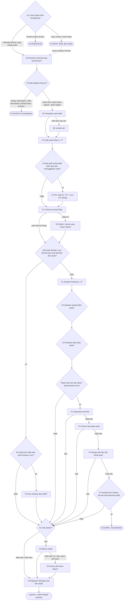

# Ilmu Waris track: lessons, case studies, adaptive questionnaire, report and visuals

Research date: 2026-10-09. Researcher scope: learning design + questionnaire + report + visuals (not the calculation engine spec, which belongs to the method researcher). Track path: `/belajar/{locale}/waris` (plan decision L9: `/belajar` is a hub of tracks).

**Status: DRAFT, nothing here is reviewed by an ustadz.** Every Islamic reference below was retrieved from the local corpus in `api/data/` (record id given) or from an official/legal source with a URL. Nothing was quoted from memory. Where I could not source something, it says so.

Senior UX baseline: `docs/belajar-research/senior-ux.md` (body 18px, Arabic ≥24px, targets ≥48px with 56px primary, ink-soft not ink-faint, never colour-only state, `prefers-reduced-motion`, "Tunggu saya" pacing, "Anda" register, plain Indonesian with the term explained in place).

---

## 0. Key findings (read this first)

1. **There is no single "MUI standard" for calculating fara'id.** MUI has fatwas on specific waris questions, not a calculation manual:
   - Fatwa MUI No. 5/MUNAS VII/MUI/9/2005, *Kewarisan Beda Agama*: no mutual inheritance between Muslims and non-Muslims; property may pass between them only as hibah, wasiat or hadiah (Himpunan Fatwa MUI pp. 478–480, [PDF](https://mui-jateng.or.id/wp-content/uploads/2018/03/39.-Kewarisan-Beda-Agama.pdf), text verified with `pdftotext`).
   - Fatwa Rakernas MUI 1984, *Adopsi*: adoption must not cut the child's nasab (Himpunan Fatwa MUI p. 305, [PDF on fatwamui.com](https://fatwamui.com/storage/266/09.-Adopsi-(pengangkatan-anak).pdf)). The fatwa text I extracted does not use the word "waris"; "anak angkat bukan ahli waris" is therefore an inference from nasab plus QS 33:4–5, and is stated directly in KHI Pasal 209 (wasiat wajibah instead).
   - Fatwa MUI No. 11/2012, *Kedudukan Anak Hasil Zina*: no nasab, waris or nafkah link to the biological father; the government may impose wasiat wajibah on him (secondary summaries only, e.g. [alsofwa.com](https://alsofwa.com/fatwa-mui-tentang-kedudukan-anak-hasil-zina-dan-perlakuan-terhadapnya/); I did not retrieve the primary PDF).
   
   The rule set Indonesian courts actually apply is the **Kompilasi Hukum Islam (Inpres 1/1991), Buku II Pasal 171–214**, plus Mahkamah Agung (MA) yurisprudensi. KHI keeps the Qur'anic shares, but in several places it changes the path or the outcome (§4.6 lists eight). **Operator decision needed (O1):** what "aligned to MUI standard" means. My recommendation is in §8.
2. **One question path can serve both methods.** If the questionnaire asks the union of what classical fiqh and KHI need (mainly "anak yang wafat lebih dulu dan meninggalkan anak"), it can compute both. The report then shows one primary result and a second column only where the two differ. The user never has to choose a madhhab or law upfront, which would be a jargon wall for seniors.
3. **The brief's example skip rule needs one correction.** "A living father ⇒ never ask about siblings" is right for the siblings' own shares. It is wrong for the **mother's** share: with no child, two or more siblings drop the mother from 1/3 to 1/6 *even when the father blocks them*. QS 4:11 conditions the mother on "ikhwah", and Fath al-Qarib C139 says the same without excluding blocked siblings. KHI Pasal 178(1) says the same. So when the mother is alive and there is no child, the tool must ask one light question: "Apakah almarhum mempunyai dua saudara atau lebih?" The jumhur position that blocked siblings still reduce the mother needs the method researcher's confirmation (O4).
4. **Typical path length is 8–12 questions** for five common Indonesian families (§4.8). That depends on four merges: who is asking + Muslim check in one question, both parents in one question, a single "keadaan khusus" screen, and rupiah moved out of the questionnaire into the report.
5. **Corpus findings that affect content:**
   - `fiqh-as-sunnah.json` is **missing chunk C1084**, the passage listing the rights on an estate (tajhiz, dayn, wasiyya). Text jumps from C1083 (`التركة`) to C1085 (`… بعد قضاء الدين. 4 - الحق الرابع`). The order of deductions therefore has to be cited from QS 4:11–12 + Ibn Kathir (consensus that debt precedes wasiat) + KHI Pasal 175, not from Fiqh as-Sunnah.
   - The addition "إلا أن يشاء الورثة" ("unless the heirs agree", Bulugh local #1115) is graded **munkar** by the editor's takhrij in our own file. The "wasiat to an heir needs the other heirs' consent" rule must be sourced from fiqh (Fath al-Qarib C140; KHI Pasal 195(3)), not from that addition.
   - Muslim numbers in `muslim.json` are fawazahmed0 sequential, not sunnah.com canonical. Mapping, checked against the fawazahmed0 API `arabicnumber`: local #4140 = Muslim 1614; #4141 = 1615a; #4145 = 1616a; #4181 = 1623e; #4209 = 1628a.
   - The Indonesian Qur'an text in `quran.json` has typos in the core waris verses: 4:11 "bagahian" (for *bahagian*) and 4:12 "seduah" (for *sesudah*). Fix these against the official Kemenag text before any lesson displays them. Also, the Arabic of the first ayah of 110 of the 112 surahs other than 1 and 9 (4:1 included) has the basmala prepended, which is not part of the ayah; trim it when showing 4:1.
   - Bulugh al-Maram numbers are local (AhmedBaset) and not canonical; the migration was deferred (`api/src/api/scripts/migrate_hadith_citations.py` docstring). Cite the local number plus the takhrij printed in the record.

---

## 1. Dalil register (all retrieved; use these IDs everywhere below)

Arabic and Indonesian text come from the corpus record named. Quran Indonesian is the Kemenag text in `quran.json`; Muslim Indonesian is the `id` field (manual translation). Bukhari, Bulugh and tafsir are EN/AR only, so **Indonesian renderings for those must be produced and reviewed**, not invented at build time.

| ID | Reference | Corpus record | What it proves (use) | Grading / caveat |
|---|---|---|---|---|
| D1 | QS An-Nisa' 4:7 | `quran.json` (4,7) | Men and women both have a share, "sedikit atau banyak" (L1, L3) | Qur'an |
| D2 | QS 4:11 | `quran.json` (4,11) | Children 2:1, daughters ½ / ⅔, parents ⅙, mother ⅓ or ⅙ with ikhwah, "sesudah wasiat atau utang", "ketetapan dari Allah" (L2, L4, L5) | Qur'an |
| D3 | QS 4:12 | `quran.json` (4,12) | Spouses ½/¼ and ¼/⅛; uterine siblings ⅙ each or share ⅓ *equally* (L4, L5) | Qur'an |
| D4 | QS 4:176 | `quran.json` (4,176) | Kalalah: sisters ½ / ⅔, brothers and sisters 2:1, sibling inherits only "jika tidak mempunyai anak" (L6) | Qur'an |
| D5 | QS 4:13–14 | `quran.json` (4,13), (4,14) | Shares are *hudud Allah* (L1) | Qur'an |
| D6 | QS 4:8 + Bukhari 4576 | `quran.json` (4,8); `bukhari.json` #4576 | When relatives, orphans and poor are present at division, give them something and speak kindly; Ibn 'Abbas: "not abrogated" (L9, case 9) | Qur'an; Bukhari |
| D7 | QS 8:75; QS 33:6 | `quran.json` | Blood relatives are "lebih berhak" in Allah's Book (L3) | Qur'an |
| D8 | QS 33:4–5 | `quran.json` (33,4), (33,5) | Adopted children are not made one's own children; call them by their fathers (L8, case 10) | Qur'an |
| D9 | QS 4:34 ("karena mereka (laki-laki) telah menafkahkan sebagian dari harta mereka"); QS 2:233; QS 65:7; Ibn Kathir on 4:11 | `quran.json`; `tafsir-ibn-kathir.json` (4,11) EN | Nafkah duty on men; Ibn Kathir: "men need money to spend on their dependants … Consequently, men get twice the portion" (L5) | Tafsir; present as *hikmah*, not as the legal cause |
| D10 | Bukhari 6732 (also 6735, 6737, 6746); Muslim 1615a | `bukhari.json` #6732; `muslim.json` #4141; Bulugh local #1095 | "Berikan bagian-bagian (waris) kepada pemiliknya, dan apa yang tersisa, maka itu untuk laki-laki yang paling dekat" (Muslim #4141 `id`) (L5, L6) | Muttafaq 'alayh (Bulugh takhrij: Bukhari 6732, Muslim 1615) |
| D11 | Bukhari 6764; Muslim 1614 | `bukhari.json` #6764; `muslim.json` #4140; Bulugh #1096; #1098 | No inheritance between Muslim and kafir; "lā yatawārathu ahlu millatayn" (L3, L8, case 11) | #1096 muttafaq 'alayh; #1098 graded *hasan* in takhrij (Abu Dawud 2911) |
| D12 | Bukhari 6736, 6742 | `bukhari.json`; Bulugh #1097 | Ibn Mas'ud: daughter ½, son's daughter ⅙ "takmilah ats-tsuluthain", rest to the sister (L6) | Bukhari |
| D13 | Bukhari 6741 | `bukhari.json` #6741 | Mu'adh: daughter ½, sister ½ (case 8, classical side) | Bukhari |
| D14 | Ibn Kathir on 4:176 | `tafsir-ibn-kathir.json` (4,176) EN | Ibn 'Abbas and Ibn az-Zubayr: with a daughter the sister gets nothing; "the majority of scholars disagreed" (case 8, KHI side) | Tafsir report of a minority view |
| D15 | Bukhari 2742, 1295; Muslim 1628a | `bukhari.json`; `muslim.json` #4209; Bulugh #1112 | Wasiat max ⅓, "dan sepertiga itu banyak"; leaving heirs rich is better (L2) | Muttafaq 'alayh |
| D16 | "Lā waṣiyyata li-wārith" | Bulugh #1114 (takhrij: Ahmad, Abu Dawud, Tirmidhi 2120, Ibn Majah 2713) | No wasiat to an heir (L2) | Editor: chain *hasan*, the sentence *sahih* through many supporting narrations; Tirmidhi: "hasan sahih". **Do not use** #1115 "illa an yasya' al-waratsah": editor grades it *munkar* |
| D17 | "Nafs al-mu'min mu'allaqah bi-daynihi" | Bulugh #649 (takhrij: Ahmad; Tirmidhi 1078, 1079) | Debts must be settled (L2) | Tirmidhi: hasan; editor: sahih via shawahid |
| D18 | Ibn Kathir on 4:11 and 4:12 | `tafsir-ibn-kathir.json` (4,11), (4,12) EN | "Paying debts comes before fulfilling the will … consensus" (L2) | Tafsir, reports ijma' |
| D19 | "Laysa li-l-qātil min al-mīrāth shay'" | Bulugh #1107 | Killer inherits nothing (L3, exit E-BUNUH) | Ibn Hajar in the matn: "aṣ-ṣawāb waqfuhu 'alā 'Umar"; editor's note: al-Albani graded it sahih (*Irwa'* 1671). Show as "dalil pendukung" with this note |
| D20 | Grandmother ⅙ when no mother | Bulugh #1103 (Abu Dawud 2895) | Nenek ⅙ (L4) | Editor: *hasan*; narrator Abu al-Munib disputed |
| D21 | Bukhari 2587, 2586; Muslim 1623e | `bukhari.json`; `muslim.json` #4181 | "Bertakwalah kepada Allah dan berlakulah adil di antara anak-anak kalian" (L8, exit E-HIDUP) | Muttafaq 'alayh |
| D22 | Bukhari 5986, 5987 | `bukhari.json` | Silaturahim (L9) | Bukhari |
| D23 | Bukhari 6723, 4577; Muslim 1616a | `bukhari.json`; `muslim.json` #4145 | Jabir sick, asks how to divide; inheritance verses revealed (L1 story hook) | Muttafaq 'alayh |
| D24 | Sa'd bin ar-Rabi''s daughters | `fiqh-as-sunnah.json` §840 C1082 ("رواه الخمسة إلا النسائي"); Ibn Kathir on 4:11 (Ahmad from Jabir) | Uncle took all; verse revealed; the Prophet ﷺ ordered: daughters ⅔, mother ⅛, rest to the uncle (L1) | Grading not printed in our records; **needs the dalil researcher's grading** before it is the L1 hero story. D23 is the safe fallback |
| D25 | First 'aul under 'Umar | `fiqh-as-sunnah.json` §852–853 C1095–C1096 | Husband + two sisters: base 6 becomes 7 (L7, case 6) | Athar reported in Fiqh as-Sunnah; KHI Pasal 192 codifies 'aul |
| D26 | Radd | `fiqh-as-sunnah.json` §854–855 C1097–C1098; `fath-al-muin.json` §34 C39 | Leftover returns to fard-holders "غير الزوجين بنسبة الفروض" (L7, cases 4, 12) | Fiqh; KHI Pasal 193 is silent on spouses (§4.6) |
| D27 | Fath al-Qarib, Kitab al-Fara'id wa al-Wasaya | `fath-al-qarib.json` §116–118 C138–C140 | Heir lists (10 men / 7 women), the five never fully blocked, the six fixed shares, hajb list, 'asabah order, wasiat ⅓ / to heir only with consent (L3–L6) | Syafi'i matn + sharh |
| D28 | 'Umariyyatan | `fath-al-muin.json` §34 C39: "وثلث باق لأم مع أحد زوجين وأب" | Mother gets ⅓ of the remainder with a spouse and father (case 5) | Syafi'i; same as KHI Pasal 178(2) |
| D29 | Peace verses | `quran.json` 4:128 ("perdamaian itu lebih baik"), 49:10, 42:38, 2:188, 4:29, 4:10 | Settle by musyawarah; never consume others' or orphans' wealth (L9) | Qur'an |
| D30 | Bukhari 6745, 6763, 2398 | `bukhari.json` | Whoever leaves wealth, it is for the heirs; whoever leaves debt or dependants, "we take care of them" (L2) | Bukhari |
| D31 | Bukhari 2738; Bulugh #1111 | `bukhari.json`; Bulugh | Have your will written (E-HIDUP) | Bukhari |

**Excluded on purpose.** "Ta'allamū al-farā'iḍ … fa-innahā niṣf al-'ilm" (Ibn Majah, quoted in `fiqh-as-sunnah.json` C1083) is the most-quoted "keutamaan ilmu waris" hadith. I have not retrieved a grading for it in our corpus, and its chain is commonly criticised. Under the strongest-dalil brief it stays out of the UI until the dalil researcher grades it. D23 and D5 carry the "why learn this" message instead.

**Arabic provenance rule for this track.** The Arabic fragments quoted in this document are for orientation. They are copied from the corpus records, but the sharh (commentary) words in Fath al-Qarib are elided with "…". In the product, every Arabic string must be **copied byte-for-byte from the retrieved record at build time**, never retyped. See the memory notes `project_arabic_provenance_check` and `project_citation_chunk_mismatch`: retyped Arabic has produced fabricated matn before. Fath al-Qarib interleaves the matn (in parentheses) with its sharh, so a card that shows "matn only" must say so.

**Legal references** (secondary transcriptions; the official BPHN PDF of Inpres 1/1991 was behind a Cloudflare challenge, so **verify the wording against the official text before publishing**):
- KHI Pasal 171–214 as transcribed at [aa-lawoffice.com](https://aa-lawoffice.com/pasal-pasal-hukum-kewarisan-dalam-khi-kompilasi-hukum-islam/). That page carries the SEMA No. 2/1994 note on Pasal 177: the father's ⅓ applies when there is no child but there are a husband and a mother.
- KHI Pasal 96 (cerai mati: half of harta bersama belongs to the surviving spouse): secondary, e.g. [PTA Samarinda](https://pta-samarinda.go.id/artikel-pengadilan/2217-pertimbangan-putusan-hakim-dalam-pembagian-harta-bersama).
- UU 1/1974 Pasal 35 (harta bersama vs harta bawaan): [copy hosted at UGM](https://luk.staff.ugm.ac.id/atur/UU1-1974Perkawinan.pdf).
- Yurisprudensi MA 86 K/AG/1994 (any child, son or daughter, blocks blood relatives other than parents and spouse): summarised in [Komisi Yudisial karakterisasi](https://karakterisasi.komisiyudisial.go.id/?view=t5nsyMraxMLmx9%2Fn2uDj18bg0g%3D%3D&id=pmao) and [ResearchGate study](https://www.researchgate.net/publication/356688359_Keadilan_Waris_Islam_dalam_Kedudukan_Anak_Perempuan_sebagai_Hajib_Hirman_terhadap_Saudara_dalam_Putusan_Mahkamah_Agung).
- Wasiat wajibah to non-Muslim relatives: MA 368 K/AG/1995, 51 K/AG/1999, 16 K/AG/2010 (summarised in [hukumonline](https://www.hukumonline.com/berita/a/mengulas-polemik-wasiat-wajibah-untuk-ahli-waris-beda-agama-lt609b72a619682/?page=2)).
- Radd to spouses under Pasal 193 is applied inconsistently by judges: [Arena Hukum UB](https://arenahukum.ub.ac.id/index.php/arena/article/view/334); [UIN Antasari study of PA Banjarmasin judges](https://idr.uin-antasari.ac.id/5439/).
- Proof of heirship: Permen ATR/BPN 16/2021 Pasal 111 (heirs' statement, court decision, notarial deed, etc.), per [BPHN Literasi Hukum](https://literasihukum.bphn.go.id/konsultasiView?id=24629); Penetapan Ahli Waris at the Pengadilan Agama, e.g. [PA Depok](https://pa-depok.go.id/penetapan-ahli-waris-paw/).

---

## 2. Lesson outline (9 short lessons, ~6–8 minutes each)

### 2.0 Lesson anatomy (same for every lesson)

The lesson uses the same "stage" pattern as the Qur'an track (senior-ux §3.5–3.6), so learners meet one interaction model:
1. **Title + one-line goal** ("Setelah pelajaran ini, Anda bisa …").
2. **The stage.** One visual, advanced step by step with a caption under it (22px). It plays at the learner's pace: Biasa / Pelan / **Tunggu saya**, with the same `captionMs` rule and no auto-advance in Tunggu saya. Controls are labelled: "‹ Sebelumnya", "Jeda", "Berikutnya ›".
3. **One dalil card.** Arabic at ≥24px (`.arabic-inline`, line-height 2) with the Indonesian meaning directly under it. The citation is a 44px chip that links to the kitab passage (AGENTS.md: link back to the source), with a draft marker until reviewed.
4. **"Contoh di keluarga kita"**: one tiny worked example on the same visual.
5. **Cek pemahaman**: 2–3 questions. Feedback uses icon + text + border (never colour-only). Two misses → "Tunjukkan jawaban". Finish with "Ulangi latihan".
6. **"Ingat"**: one sentence to take away.

Theory is kept to what a family needs at the table. Vocabulary is introduced once with a visible gloss: *ahli waris* (orang yang berhak menerima), *furudh* (bagian pasti), *'ashabah* (penerima sisa), *hajb* (terhalang), *'aul* (bagian dikurangi bersama karena berlebih), *radd* (sisa dikembalikan). Arabic terms always go with the Indonesian gloss in brackets, never in a hover tooltip.

**Shared visual vocabulary** (defined once, reused in lessons, cases and the report):
- **Bilah harta (estate bar):** a horizontal bar made of equal tiles. The number of tiles is the *asal masalah* (common denominator) once the lesson reaches fractions: 6, 8, 12, 24, or 24×k after adjustment. Each heir's tiles carry a **pattern + a text label + a fraction**, never colour alone. Patterns: solid, diagonal hatch, dots, cross-hatch, horizontal lines, vertical lines. Above 48 tiles, the bar switches to proportional segments, so a tile is never thinner than about 6px.
- **Pohon keluarga (family tree):** an SVG with three to four generation rows. "Almarhum/almarhumah" sits in the centre with a double border; spouse beside; parents and grandparents above; siblings on the same row to the side; children and grandchildren below. Node: rounded rect ≥120×56px, role label in ink ("Ibu", "Anak laki-laki ×2").
- **States:**
  - *Mendapat bagian:* solid border + share chip ("⅛").
  - *Terhalang:* dashed border, diagonal hatch on the *fill only* (label stays ink at ≥4.5:1), ⊘ icon, and the caption "Terhalang oleh: Anak laki-laki". A thin connector runs from blocker to blocked.
  - *Bukan ahli waris:* sits outside the tree in a separate box titled "Disayangi, tetapi bukan ahli waris".
  - *Wafat lebih dulu:* grey outline with the text marker "wafat lebih dulu" (no cross, crescent or other symbol); their children hang below it.

### L1. Warisan adalah ketetapan Allah, bukan pemberian keluarga

- **Goal:** Anda tahu bahwa bagian waris ditetapkan Allah sendiri, termasuk untuk perempuan dan anak, dan karena itu harus ditunaikan.
- **Visual: "sebelum dan sesudah ayat turun".**
  - *Frame 1:* a single estate bar, all tiles stacked on one figure labelled "Paman". Two small figures, "Dua putri", stand with an empty tray; a third, "Ibu mereka", also has an empty tray. Caption: "Di masa Jahiliyah, warisan diberikan kepada laki-laki, tidak kepada perempuan." (Ibn Kathir on 4:11: "The people of Jahiliyyah used to give the males, but not the females, a share in the inheritance.")
  - *Frame 2:* the verse card for QS 4:7 slides up. Then the tiles **lift off the uncle and fall into three trays**: ⅔ to the daughters, ⅛ to their mother, and the remaining 5/24 back to the uncle.
  - Each tray shows its fraction and the words ("dua pertiga", "seperdelapan", "sisanya").
  - Reduced motion: two static frames side by side, "Sebelum" and "Sesudah".
- **Dalil:** D1 (QS 4:7), D5 (QS 4:13), D2 ending ("ketetapan dari Allah"). Story: D24 (Sa'd bin ar-Rabi') **only after grading**; otherwise D23 (Jabir: the verses came as the Prophet ﷺ's answer to "bagaimana aku membagi hartaku?").
- **Cek:**
  1. Siapa yang menetapkan besar bagian waris? *(Allah — QS 4:11 "ketetapan dari Allah")*
  2. Benar atau salah: perempuan tidak berhak atas warisan. *(Salah — QS 4:7)*
  3. Dalam kisah tadi, setelah ayat turun, siapa yang tetap mendapat sisa? *(Paman — sebagai penerima sisa)*

### L2. Sebelum dibagi: pisahkan, bayar, tunaikan

- **Goal:** Anda bisa mengurutkan apa yang dikeluarkan sebelum warisan dibagi: (0) memisahkan harta milik pasangan, (1) biaya jenazah, (2) utang, (3) wasiat paling banyak ⅓ untuk yang bukan ahli waris, (4) baru dibagi.
- **Visual: "bilah yang menyusut".**
  - One long bar labelled "Semua harta di rumah ini".
  - *Step 0:* the bar splits along a vertical seam into "Harta bersama (gono-gini)" and "Harta pribadi almarhum". Half of the gono-gini part **slides across to the spouse's side** with the label "Milik pasangan — bukan warisan" (KHI Pasal 96). Caption: "Yang bukan milik almarhum tidak ikut diwariskan."
  - *Steps 1–3:* three tiles peel off the right end one at a time, each into a labelled box: "Biaya jenazah", "Utang", "Wasiat".
  - The wasiat box has a **dashed line at ⅓** of what remains after jenazah and debts (KHI 171(e) with 195(2); the Syafi'i reading to be confirmed by the method researcher). If the wasiat tile is longer than the line, it **springs back to the line** with the caption "Lebih dari sepertiga perlu persetujuan semua ahli waris."
  - *Step 4:* what remains is relabelled "Harta waris — inilah yang dibagi".
  - Reduced motion: four static rows, each one shorter, with a "−" label between them.
- **Dalil:** D2 ("sesudah dipenuhi wasiat yang ia buat atau (dan) sesudah dibayar hutangnya"), D18 (Ibn Kathir: debts before wasiat by consensus), D17 (jiwa orang beriman tergantung pada utangnya), D15 (Sa'd, Muslim #4209 `id`: "Sepertiga, dan sepertiga itu banyak. Sesungguhnya bila engkau meninggalkan ahli warismu dalam keadaan kaya, lebih baik …"), D16 (no wasiat to an heir), D30 (the Prophet ﷺ took on the debts of those who died owing). Legal: KHI Pasal 171(e), 175, 195(2)–(3); UU 1/1974 Pasal 35.
- **Note for review:** the order *jenazah → utang* is standard Syafi'i, but our corpus chunk that states it (Fiqh as-Sunnah C1084) is missing (§0 item 5). The dalil researcher should retrieve it from another kitab before this step is shown as "urutan menurut ulama". KHI Pasal 175(1) lists the same order and can be cited meanwhile.
- **Cek:**
  1. Urutkan: wasiat, utang, biaya jenazah. *(Jenazah → utang → wasiat)*
  2. Almarhum berwasiat setengah hartanya untuk masjid. Bolehkah dilaksanakan seluruhnya? *(Hanya sampai ⅓, kecuali semua ahli waris setuju — D15, KHI 195(2))*
  3. Apakah separuh harta gono-gini milik istri ikut dibagi sebagai warisan? *(Tidak — KHI Pasal 96)*

### L3. Siapa saja ahli waris?

- **Goal:** Anda bisa menunjuk pada pohon keluarga siapa yang termasuk ahli waris, siapa yang selalu mendapat bagian, dan siapa yang bukan ahli waris walaupun dekat di hati.
- **Visual: "lingkaran kedekatan".**
  - The tree builds outward from the centre.
  - *Ring 1* appears first with a solid thick border and the label **"Selalu mendapat bagian"**: pasangan, ayah, ibu, anak laki-laki, anak perempuan (D27, matn: "ومن لا يسقط … بحال خمسة").
  - *Ring 2:* grandparents, grandchildren through sons, siblings.
  - *Ring 3:* nephews through brothers, uncles and cousins on the father's side. Rings 2–3 have a thinner border and the label "Mendapat bagian jika tidak terhalang".
  - Then a separate box drops in below the tree: **"Disayangi, tetapi bukan ahli waris"**, holding menantu, mertua, anak tiri and anak angkat. Each has a "Bisa diberi hibah atau wasiat" chip.
  - *Last step:* two "penghalang" badges. ⊘ "Berbeda agama" (D11) and ⊘ "Menyebabkan wafatnya pewaris" (D19, KHI 173) can attach to any node, which then shows the hatched "terhalang" state.
- **Dalil:** D7 (ulul arham), D3 (spouses inherit), D27 (heir lists), D8 (adopted child), D11, D19 with its grading note.
- **Cek:**
  1. Tap semua yang *selalu* mendapat bagian. *(Pasangan, ayah, ibu, anak laki-laki, anak perempuan)*
  2. Apakah anak tiri termasuk ahli waris dari ayah tirinya? *(Tidak; bisa diberi hibah/wasiat)*
  3. Seorang anak berbeda agama dengan ayahnya yang Muslim. Apakah ia ahli waris menurut fatwa MUI? *(Tidak — D11; MUI 5/2005: bisa melalui hibah, wasiat, hadiah)*

### L4. Enam bagian pasti: ½, ¼, ⅛, ⅔, ⅓, ⅙

- **Goal:** Anda mengenal enam pecahan di dalam Al-Qur'an dan siapa pemiliknya dalam keadaan yang paling umum.
- **Visual: "kartu pecahan".**
  - Six cards, each a bar filled to its fraction with the word under it ("setengah", "seperempat" …).
  - Below them, a **toggle "Almarhum punya anak? Ya / Tidak"**. Flipping it animates the spouse cards: the husband's ½ bar **halves to ¼**, and the wife's ¼ halves to ⅛. Caption: "Adanya anak mengurangi bagian pasangan."
  - Same toggle for the mother: ⅓ → ⅙ "jika ada anak, atau dua saudara atau lebih".
  - A daughters stepper (1 → 2 → 3) shows ½ → ⅔ → ⅔ split in three. Caption: "Dua atau lebih anak perempuan berbagi dua pertiga."
  - Reduced motion: a static two-column table ("Tanpa anak / Ada anak") with the same bars.
- **Dalil:** D2, D3, D4, D20 (grandmother ⅙), D27 (matn: "والفروض المذكورة … في كتاب الله تعالى ستة"). KHI Pasal 176–182 restate the same shares.
- **Cek:**
  1. Istri, dan almarhum punya anak. Berapa bagian istri? *(⅛)*
  2. Suami, dan almarhumah tidak punya anak. *(½)*
  3. Dua anak perempuan tanpa anak laki-laki. *(Bersama-sama ⅔)*

### L5. Penerima sisa ('ashabah) dan mengapa laki-laki 2 : 1

- **Goal:** Anda paham bahwa setelah bagian pasti dibagikan, sisanya untuk kerabat laki-laki terdekat, dan bahwa anak laki-laki dan perempuan berbagi 2 : 1 dengan hikmah tanggungan nafkah.
- **Visual 1: "gelas dan sisa".**
  - Fard-holders are cups of fixed size (⅛, ⅙ …). Tiles pour in and stop exactly at each cup's mark.
  - The remaining tiles flow into a wide basin labelled "Sisa → kerabat laki-laki terdekat".
  - With a son and a daughter in the basin, tiles drop in rhythm **two to the son, one to the daughter**, and a counter shows "2 : 1".
- **Visual 2: "ke mana uang itu pergi" (the hikmah).**
  - The son's stack sprouts labelled arrows to "istri", "anak-anak", "orang tua yang ia tanggung", each with the tag "kewajiban nafkah".
  - The daughter's stack has one arrow back to herself, "miliknya sendiri; nafkahnya ditanggung ayah atau suami".
  - Caption: "Di antara hikmahnya: laki-laki menanggung nafkah keluarga."
  - The caption avoids claiming that this is *the* reason (no overclaiming); the rule itself stands on D2.
- **Then one counter-example card**, so learners don't over-generalise: "Tidak selalu 2 : 1".
  - *Saudara seibu* share ⅓ **sama rata**, laki-laki dan perempuan (D3: "mereka bersekutu dalam yang sepertiga itu").
  - *Ayah dan ibu* each get ⅙ when there is a child (D2).
- **Dalil:** D10 (sisa untuk laki-laki terdekat), D2 ("bahagian seorang anak lelaki sama dengan bagahian [sic] dua orang anak perempuan"; corpus typo, see §0 item 5), D9 (QS 4:34 "karena mereka (laki-laki) telah menafkahkan sebagian dari harta mereka", QS 2:233 "kewajiban ayah memberi makan dan pakaian", Ibn Kathir on 4:11).
- **Cek:**
  1. Istri ⅛, sisanya untuk 1 anak laki-laki dan 1 anak perempuan. Berapa perbandingan mereka? *(2 : 1)*
  2. Benar atau salah: dalam waris Islam perempuan selalu mendapat setengah laki-laki. *(Salah — saudara seibu sama rata; ayah dan ibu sama-sama ⅙ bila ada anak)*
  3. Siapa yang mengambil sisa jika ada anak laki-laki dan saudara laki-laki? *(Anak laki-laki)*

### L6. Siapa menghalangi siapa (hajb)

- **Goal:** Anda bisa menjelaskan mengapa sebagian kerabat tidak mendapat bagian: ada kerabat lain yang lebih dekat.
- **Visual 1: "tangga penerima sisa".** *(Corrected in review 2026-10-09. As drafted, tapping "Ada" hatched every rung below as "Terhalang oleh {rung}". That taught two wrong rules: that a son excludes the father and the grandfather, who are never excluded and keep ⅙ (QS 4:11; Fath al-Qarib § 116 "ومن لا يسقط بحال خمسة … والأبوان"); and that the grandfather excludes full and consanguine siblings, which is the Abu Bakr/Hanafi view, not Zaid's method that the engine uses (Fath al-Mu'in § 34 "والجد كالأب إلا أنه لا يحجب الإخوة لأبوين أو لأب"; al-Umm § 556).)*
  - A vertical ladder of **residuary** rungs: Anak laki-laki → Cucu laki-laki dari anak laki-laki → Ayah → Kakek → Saudara laki-laki kandung → Saudara laki-laki seayah → Keponakan laki-laki (kandung → seayah) → Paman kandung → Paman seayah → Sepupu (D27, Fath al-Qarib order).
  - The learner taps "Ada" on a rung. Rungs below it are labelled **"tidak menjadi penerima sisa"**, not "terhalang".
  - **Ayah** and **Kakek** keep a persistent "⅙" chip when a son or a son's son is present. They are never hatched.
  - The **Kakek** rung is marked "berbagi dengan saudara (cara Zaid)". Tapping it does **not** change the sibling rungs; it opens a small note instead.
  - Only true exclusions (hajb hirman) are hatched, e.g. siblings below a son or below the father.
  - The states are generated from the engine's `blockers()` at build time, so the lesson cannot drift from the calculation.
  - Tapping "Tidak ada" lets the highlight drop to the next rung.
- **Visual 2: "pohon yang meredup".**
  - The family tree from L3. Adding a living son makes siblings, nephews and uncles **fade with a connector line from the son** and the label "dihalangi oleh Anak laki-laki".
  - Adding a living father does the same for grandfather, paternal grandmother and siblings.
  - The mother is **not** faded by the father. A small note says "Ibu tidak terhalang oleh ayah; nenek terhalang oleh ibu".
- **Special card: the mother's share and siblings.** Even siblings who are themselves blocked by the father still reduce the mother from ⅓ to ⅙ (D2; KHI 178(1)). Shown as a faded sibling pair whose dotted arrow still points at the mother's card. *(Method-researcher confirmation, O4.)*
- **Dalil:** D10 ("laki-laki yang paling dekat"), D4 (saudara mewarisi "jika tidak mempunyai anak"), D12 (cucu perempuan ⅙ bersama satu anak perempuan), D27 hajb list (matn: "ويسقط الأخ للأب والأم مع ثلاثة الابن، وابن الابن … والأب").
- **Cek:**
  1. Ada anak laki-laki dan dua saudara kandung. Siapa yang terhalang? *(Kedua saudara)*
  2. Ayah masih hidup. Apakah kakek mendapat bagian? *(Tidak)*
  3. Ibu masih hidup. Apakah nenek mendapat bagian? *(Tidak)*

### L7. Kalau bagiannya berlebih ('aul) atau tersisa (radd)

- **Goal:** Anda paham dua penyesuaian. Kalau jumlah bagian lebih dari satu, semua dikurangi sebanding ('aul). Kalau ada sisa dan tidak ada penerima sisa, sisa dikembalikan sebanding (radd).
- **Visual 1: 'aul, "gelas yang meluap".**
  - A container drawn as 6 tiles wide. The husband's ½ (3 tiles) goes in, then two sisters' ⅔ (4 tiles). The 7th tile **pokes out past the container edge**, caption "Bagiannya berjumlah 7/6 — lebih dari harta yang ada".
  - Then the container **re-draws as 7 tiles wide** (the edge slides outward) and every tile narrows by the same ratio, ending exactly at the edge.
  - Before/after labels: "Suami ½ → 3/7", "Dua saudara perempuan ⅔ → 4/7". Caption: "Semua berkurang bersama, sebanding — tidak ada yang didahulukan."
- **Visual 2: radd, "sisa yang mengalir pulang".**
  - Daughter ½ (3 of 6 tiles), mother ⅙ (1 tile). Two empty tiles remain, and the 'ashabah basin from L5 is shown **empty with the label "Tidak ada penerima sisa"**.
  - The two leftover tiles **flow back** along curved arrows, split 3 : 1 → daughter ¾, mother ¼.
  - If a spouse is present, the spouse's cup has a small lid with the label "Pasangan tidak menerima radd (pendapat jumhur/Syafi'i)", and a "Lihat catatan KHI" chip opens the divergence note (§4.6, case 12).
- **Dalil:** D25 ('Umar's first 'aul), D26 (radd "selain suami-istri, sebanding bagian"). KHI Pasal 192, 193.
- **Cek:**
  1. Suami ½ dan dua saudara perempuan ⅔. Jumlahnya lebih dari satu. Apa yang dilakukan? *('Aul: dijadikan 7 bagian; suami 3/7, saudara 4/7)*
  2. Anak perempuan ½ dan ibu ⅙, tidak ada kerabat lain. Ke mana sisa ⅓? *(Kembali kepada mereka 3 : 1)*

### L8. Situasi yang sering terjadi di Indonesia

- **Goal:** Anda bisa mengenali enam situasi umum dan tahu ke mana harus melangkah.
- **Visual:** six flip cards. The front shows a one-line situation with a tiny tree icon. The back shows a 3-row answer: "Menurut fikih", "Menurut KHI/Pengadilan Agama", "Yang bisa Anda lakukan". Flip is a 3D rotate; reduced motion is an instant swap with a "Lihat jawaban" button.
  1. **Gono-gini.** Pisahkan dulu separuh harta bersama untuk pasangan yang masih hidup (KHI 96; UU 1/1974 Ps. 35). Visual re-use from L2.
  2. **Anak angkat.** Bukan ahli waris (D8; MUI 1984 menjaga nasab). KHI 209: wasiat wajibah paling banyak ⅓ jika tidak diberi wasiat.
  3. **Kerabat berbeda agama.** Tidak saling mewarisi (D11; MUI 5/2005). Bisa diberi hibah, wasiat atau hadiah (MUI 5/2005). Pengadilan Agama dalam beberapa putusan memberi wasiat wajibah (MA 368 K/AG/1995 dst.).
  4. **Cucu yang orang tuanya wafat lebih dulu.** Fikih klasik: cucu dari anak laki-laki mewarisi hanya jika tidak ada anak laki-laki; cucu dari anak perempuan tidak termasuk ahli waris utama. KHI 185: "ahli waris pengganti". QS 4:8 + D6 for giving them something in any case.
  5. **Dibagi semasa hidup.** Itu hibah, bukan waris. Berlaku adil di antara anak (D21). KHI 211: hibah orang tua kepada anak dapat diperhitungkan sebagai warisan; KHI 213: hibah saat sakit menjelang wafat perlu persetujuan ahli waris.
  6. **Harta tidak dibagi bertahun-tahun, lalu ada ahli waris yang wafat.** Hitung dulu pembagian dari almarhum pertama. Bagian ahli waris yang kemudian wafat dibagi lagi kepada ahli warisnya sendiri. Visual: two stacked trees, the second hanging from one node of the first.
- **Dalil:** as listed per card. **Tone rule:** cards 2, 3 and 4 are emotionally loaded. Lead with "Islam tetap membuka jalan kebaikan untuk mereka" (hibah, wasiat, QS 4:8) before "bukan ahli waris".
- **Cek:**
  1. Seorang ayah membagi tanahnya kepada anak-anak saat ia masih sehat. Ini waris atau hibah? *(Hibah)*
  2. Apa yang dipisahkan lebih dulu sebelum menghitung warisan seorang suami yang wafat? *(Separuh harta bersama untuk istri)*
  3. Bolehkah memberi sebagian harta kepada anak angkat? *(Boleh, melalui hibah semasa hidup atau wasiat ≤⅓)*

### L9. Membagi dengan damai

- **Goal:** Anda tahu langkah praktis membagi warisan tanpa memutus silaturahim.
- **Visual: "meja musyawarah".**
  - A round table seen from above, with heirs as cards around it, each showing their fraction from the calculation.
  - *Step 1:* "Ketahui hak masing-masing". Every card flips to show its share.
  - *Step 2:* "Bicarakan". Neutral speech-bubble icons appear; no faces or expressions.
  - *Step 3:* "Sepakati". One tile slides from one heir's card to another, labelled "Diberikan dengan rela, setelah tahu haknya" (KHI 183). The giver's card keeps a ghost outline of the original share, so the learner sees that the right existed first.
  - *Step 4:* "Catat". A document icon labelled "Surat keterangan ahli waris / Penetapan Pengadilan Agama".
  - *Step 5:* "Jika buntu". A path to "Mediasi / Pengadilan Agama" (KHI 188).
- **Dalil:** D29 (QS 4:128 "perdamaian itu lebih baik"; 49:10; 42:38 musyawarah; 2:188 and 4:10 warnings), D6 (QS 4:8 give the relatives, orphans and poor who are present something, and speak kindly), D22 (silaturahim). Legal: KHI 183, 187, 188, 189 (keep farmland <2 ha intact where possible).
- **Cek:**
  1. Bolehkah seorang ahli waris memberikan sebagian haknya kepada saudaranya? *(Boleh, dengan rela setelah tahu haknya — KHI 183)*
  2. Apa yang dianjurkan QS 4:8 bila kerabat atau anak yatim hadir saat pembagian? *(Beri mereka sekadarnya dan ucapkan perkataan yang baik)*

---

## 3. Case studies (12, easy → hard)

Names are neutral and fictional. Every case states that it assumes the deceased was Muslim, the heirs listed were alive at the moment of death, and no special situation applies (no missing person, no unborn heir). Amounts are **harta waris bersih** (after the L2 deductions) unless the case says otherwise. All arithmetic was checked with exact fractions (`scratchpad/check_cases.py`, Python `fractions.Fraction`).

Each case card in the UI has four parts:
1. "Keluarganya": the tree.
2. "Coba tebak dulu": an optional prediction tap.
3. "Jawabannya": the estate bar plus a table of pecahan / persen / Rp.
4. "Kenapa begitu": two to four caption steps, each pointing at the visual, plus the dalil chip(s).

Cases 8–12 also get a **"Fikih vs KHI" split view** where the two methods differ.

### Kasus 1 — Keluarga inti (L4, L5)
**Pak Hasan** wafat. Ahli waris: istri, 2 anak laki-laki, 1 anak perempuan. Harta waris Rp 400 juta.

| Ahli waris | Bagian | % | Rp |
|---|---|---|---|
| Istri | ⅛ | 12,5 | 50 jt |
| Anak laki-laki (masing-masing) | 7/20 | 35 | 140 jt |
| Anak perempuan | 7/40 | 17,5 | 70 jt |

**Visual:** a 40-tile bar. The wife's cup takes 5 tiles (⅛). The remaining 35 drop into the 'ashabah basin in a 2-2-1 rhythm (14 + 14 + 7). **Dalil:** D3 (⅛ bila ada anak), D2 (2 : 1).

### Kasus 2 — Saudara yang terhalang (L6)
**Pak Slamet** wafat. Istri, ibu, 1 anak laki-laki, dan 2 saudara laki-laki kandung. Harta Rp 480 juta.

| Ahli waris | Bagian | Rp |
|---|---|---|
| Istri | ⅛ | 60 jt |
| Ibu | ⅙ | 80 jt |
| Anak laki-laki | sisa = 17/24 | 340 jt |
| 2 saudara laki-laki kandung | — terhalang oleh anak laki-laki | 0 |

**Visual:** the tree. The son's node lights up, then both brothers fade to hatched with a connector from the son and the caption "dihalangi oleh Anak laki-laki". The caption also says: "Mereka tetap keluarga — QS 4:8 menganjurkan memberi kerabat yang hadir sekadarnya." **Dalil:** D10, D27 hajb list, D6. Fikih and KHI agree.

### Kasus 3 — Gono-gini, utang dan wasiat dulu (L2)
**Pak Darto** wafat. Harta yang diperoleh selama menikah (rumah, tabungan): Rp 1 miliar. Sawah warisan dari orang tuanya: Rp 300 juta. Biaya jenazah Rp 12 juta, utang Rp 48 juta, wasiat untuk masjid Rp 20 juta. Ahli waris: istri, ibu, 1 anak laki-laki, 1 anak perempuan.

Steps shown on the shrinking bar:
1. Separuh harta bersama (Rp 500 jt) milik istri, not inherited (KHI 96).
2. Harta peninggalan = 500 + 300 = Rp 800 jt.
3. − jenazah 12 − utang 48 = Rp 740 jt.
4. The wasiat of Rp 20 jt is ≤ ⅓ of 740, so it is carried out in full → **harta waris Rp 720 jt**.

| Ahli waris | Bagian | Rp |
|---|---|---|
| Istri | ⅛ | 90 jt (plus her own Rp 500 jt half of the harta bersama) |
| Ibu | ⅙ | 120 jt |
| Anak laki-laki | 17/36 | 340 jt |
| Anak perempuan | 17/72 | 170 jt |

**Visual:** L2's bar, then the 72-tile result. Above 48 tiles it switches to proportional segments, labelled. **Dalil:** D2, D18, D15. **Method note:** the 50 % split of harta bersama comes from KHI 96 / UU 1/1974 Ps. 35, not from a classical text. In classical fiqh the question is simply who owns what. The report says this in "Catatan metode".

### Kasus 4 — Radd: sisa kembali kepada keluarga (L7)
**Bu Aminah** wafat (suami telah wafat lebih dulu). Ahli waris: 1 anak perempuan dan ibu. Tidak ada ayah, saudara, keponakan, paman atau sepupu. Harta Rp 240 juta.

Bagian pasti: anak perempuan ½, ibu ⅙ = ⅔. Sisa ⅓ dikembalikan 3 : 1.

| Ahli waris | Akhir | Rp |
|---|---|---|
| Anak perempuan | ¾ | 180 jt |
| Ibu | ¼ | 60 jt |

**Visual:** L7 visual 2 (leftover tiles flowing back). **Dalil:** D2, D26. **Method note:** Fath al-Mu'in records that the original Syafi'i position gives the leftover to Baitul Mal, and radd applies "if Baitul Mal is not in order" (`إن لم ينتظم المال`). Indonesian practice and KHI 193 apply radd. Label: "menurut pendapat yang dipakai di Indonesia".

### Kasus 5 — Ibu mendapat sepertiga *dari sisa* (gharrawain)
**Bu Nur** wafat. Ahli waris: suami, ayah, ibu. Tidak punya anak, dan kurang dari dua saudara. Harta Rp 300 juta.

| Ahli waris | Bagian | Rp |
|---|---|---|
| Suami | ½ | 150 jt |
| Ibu | ⅓ × sisa = ⅙ | 50 jt |
| Ayah | sisa = ⅓ | 100 jt |

**Visual:** the husband takes the left half of the bar. A bracket then marks the *remaining half*, and the mother takes ⅓ **of the bracket** (the bracket is drawn so the "of the remainder" idea is visible). The father takes the rest. Caption: "Agar ibu tidak mendapat lebih dari ayah dalam keadaan ini." The caption must be reviewed: it states a commonly given hikmah that I did not retrieve from our corpus.

Variant shown as a toggle, "Jika yang wafat suami": istri ¼, ibu ⅓ × ¾ = ¼, ayah ½. **Dalil:** D2, D28 ("وثلث باق لأم مع أحد زوجين وأب"). KHI 178(2) is identical; SEMA 2/1994 on Ps. 177 refers to this case.

### Kasus 6 — 'Aul: perkara pertama di masa 'Umar (L7)
**Bu Lastri** wafat. Ahli waris: suami dan 2 saudara perempuan kandung. Tidak ada anak, ayah atau ibu. Harta Rp 210 juta.

Suami ½ (3/6) + dua saudara ⅔ (4/6) = 7/6 → 'aul to 7.

| Ahli waris | Bagian | Rp |
|---|---|---|
| Suami | 3/7 | 90 jt |
| Saudara perempuan (masing-masing) | 2/7 | 60 jt |

**Visual:** L7 visual 1 (container overflows, then widens to 7). **Dalil:** D3, D4, D25 (the same case brought to 'Umar). KHI 192.

### Kasus 7 — 'Aul di keluarga muda
**Pak Yusuf** wafat muda. Ahli waris: istri, ayah, ibu, 2 anak perempuan. Harta Rp 270 juta.

Base 24: istri 3 + ayah 4 + ibu 4 + anak perempuan 16 = 27 → 'aul to 27.

| Ahli waris | Bagian | Rp |
|---|---|---|
| Istri | 3/27 = 1/9 | 30 jt |
| Ayah | 4/27 | 40 jt |
| Ibu | 4/27 | 40 jt |
| Anak perempuan (masing-masing) | 8/27 | 80 jt |

**Visual:** 24 tiles plus 3 overflowing, then the bar redraws as 27. A "sebelum/sesudah" chip on the wife reads "⅛ → 1/9". **Dalil:** D2, D3. KHI 192.

### Kasus 8 — Anak perempuan dan saudara perempuan: fikih vs KHI
**Pak Bambang** wafat (istri telah wafat lebih dulu; ayah dan ibu telah wafat). Ahli waris: 1 anak perempuan, 1 saudara perempuan kandung. Harta Rp 300 juta.

| | Fikih (jumhur/Syafi'i) | Praktik Pengadilan Agama (KHI + Yurisprudensi MA 86 K/AG/1994) |
|---|---|---|
| Anak perempuan | ½ = 150 jt | seluruhnya: ½ + radd = 300 jt |
| Saudara perempuan kandung | ½ (as 'ashabah ma'al ghair) = 150 jt | terhalang oleh anak perempuan = 0 |

**Visual:** a split screen with the same tree twice. On the left, the sister has a solid border and "½". On the right, she is hatched with "dihalangi oleh Anak perempuan (praktik MA)".
**Dalil:**
- Left: D13 (putusan Mu'adh di Yaman — an atsar, not a saying of the Prophet ﷺ: daughter ½, sister ½; one chain in Bukhari 6741 adds "on the Prophet's lifetime" but Sulaiman's narration omits it, so do not claim it; review 2026-10-09) and D12 (Ibn Mas'ud reporting the Prophet's ruling, Bukhari 6736).
- Right: D14 (Ibn 'Abbas and Ibn az-Zubayr read "laysa lahu walad" in QS 4:176 to include a daughter; Ibn Kathir notes the majority disagreed) and MA 86 K/AG/1994.

**Tone:** present both as recognised positions. No "yang benar adalah …". Next step: "Jika keluarga sepakat, gunakan musyawarah (KHI 183); jika dibawa ke Pengadilan Agama, umumnya mengikuti kolom kanan."

### Kasus 9 — Cucu yang orang tuanya wafat lebih dulu
**Mbah Karto** wafat (istri telah wafat). Anak: Budi (laki-laki, masih hidup) dan Sari (perempuan, wafat 5 tahun lebih dulu, meninggalkan 2 anak perempuan). Harta Rp 300 juta.

| | Fikih (jumhur/Syafi'i) | KHI Pasal 185 (ahli waris pengganti) |
|---|---|---|
| Budi | seluruhnya: 300 jt | ⅔ = 200 jt |
| 2 cucu dari Sari | bukan ahli waris utama (cucu dari anak perempuan) = 0 | menggantikan Sari: ⅓ → ⅙ each = 50 jt each |

**Visual:** Sari's node is drawn with a grey outline and "wafat lebih dulu". In KHI view, her empty tray **tilts and pours down** into her two daughters' trays below. In fikih view, her tray stays empty, and an arrow labelled "QS 4:8: berilah mereka sekadarnya" invites a voluntary gift from Budi.
**Dalil:** D10, D6 (QS 4:8 and Bukhari 4576). KHI 185(1)–(2).
**Method note (O3):** how a pengganti share is capped and split among several grandchildren is interpreted variously by courts. This case uses the simplest reading (Sari's share as if alive, split equally between two granddaughters, and ⅓ ≤ Budi's ⅔ satisfies 185(2)). The method researcher must confirm it.

### Kasus 10 — Anak angkat
**Pak Herman** wafat. Ahli waris: istri, 1 saudara laki-laki kandung. Mereka membesarkan **Dimas**, anak angkat melalui penetapan pengadilan. Harta pribadi almarhum (setelah gono-gini dipisahkan) Rp 360 juta. Tidak ada wasiat untuk Dimas.

| | Fikih + MUI 1984 | KHI Pasal 209(2) (wasiat wajibah, paling banyak ⅓) |
|---|---|---|
| Dimas | bukan ahli waris; dapat diberi hibah/hadiah oleh keluarga | paling banyak ⅓ = 120 jt (amount set by the court) |
| Istri | ¼ = 90 jt | ¼ of the rest = 60 jt (at the maximum) |
| Saudara laki-laki | ¾ = 270 jt | ¾ of the rest = 180 jt (at the maximum) |

**Visual:** Dimas sits in the "Disayangi, tetapi bukan ahli waris" box. In KHI view, a dotted tile labelled "wasiat wajibah ≤ ⅓" slides out of the bar *before* the division, like the wasiat in L2.
**Dalil:** D8 (QS 33:4–5), D15 (⅓ ceiling logic). Message first: "Islam memuliakan pengasuhan anak; jalannya melalui hibah atau wasiat." **Lesson for the living (E-HIDUP):** write the wasiat for an adopted child while alive (D31).

### Kasus 11 — Anak yang berbeda agama
**Pak Anton** wafat. Istri dan 2 anak laki-laki beragama Islam; 1 anak perempuan beragama lain. Harta Rp 320 juta.

| | Fikih + Fatwa MUI 5/2005 | Praktik sebagian putusan MA (wasiat wajibah) |
|---|---|---|
| Anak perempuan | bukan ahli waris; dapat diberi hibah/hadiah oleh keluarga | wasiat wajibah ≤ ⅓, ditetapkan hakim |
| Istri | ⅛ = 40 jt | depends on the amount set |
| Anak laki-laki (masing-masing) | 7/16 = 140 jt | depends on the amount set |

**Illustration only, and labelled so** *(corrected in review 2026-10-09)*: in the method of MA 16 K/AG/2010 and 51 K/Ag/1999 the daughter receives, as wasiat wajibah, the share she would have had as an heir, and every heir keeps their as-if share: istri ⅛ = Rp 40 jt, each son Rp 112 jt, the daughter Rp 56 jt. Do **not** show this as a result. Show it behind "Lihat contoh cara putusan MA", with "besarnya ditetapkan hakim". *(The draft's numbers, istri Rp 33 jt and each son Rp 115,5 jt, came from taking the ceiling off first and re-dividing. No cited MA decision computes it that way, and it puts the wife below her Qur'anic ⅛.)*
**Visual:** the daughter's node carries the ⊘ "berbeda agama" badge, with a dotted "hibah/wasiat" arrow from the family to her. **Dalil:** D11 + MUI 5/2005 (which itself says hibah, wasiat and hadiah are allowed). **Tone:** "Hubungan anak dan orang tua tidak putus karena perbedaan agama; Islam memerintahkan berbuat baik" can cite QS 60:8 (`quran.json` 60:8), subject to the dalil researcher's review.

### Kasus 12 — Radd ketika ada pasangan: fikih vs KHI
**Pak Rahmat** wafat. Ahli waris: istri dan 1 anak perempuan. Tidak ada orang tua, saudara, keponakan, paman, sepupu, atau kerabat lain. Harta Rp 400 juta.

| | Fikih (jumhur/Syafi'i): radd selain suami-istri | KHI Pasal 193 dibaca harfiah (sebagian hakim) |
|---|---|---|
| Istri | ⅛ = 50 jt | 1/5 = 80 jt |
| Anak perempuan | ½ + seluruh sisa = 7/8 = 350 jt | 4/5 = 320 jt |

**Visual:** L7 radd flow. On the left, the wife's cup has the "lid" (no radd). On the right, the leftover splits 1 : 4 into both cups. The case deliberately has no other relatives, so the only open question is whether the spouse shares in the radd.
**Dalil:** D26 (Fath al-Mu'in "غير الزوجين"), KHI 193, studies of inconsistent PA practice (Arena Hukum UB; UIN Antasari). **Method decision O5** (§8).

---

## 4. Adaptive questionnaire ("Cek Waris Keluarga")

> **Review 2026-10-09.** `docs/waris-plan.md` §5.7 lists the questionnaire changes that supersede this section where they differ. Among them: relevance is `couldAffectOutcome` over both rulesets; there are new nodes A1 planning, A3a religion groups, A3b adoption, C4b and F5 beyond-depth detection, G1 multi-select, G2 and a G3 "lebih dari ⅓" option, and a split B1; there is a per-node "Tidak tahu" table; and the killer answer is kept out of storage and print. Rows corrected in place below are marked.

### 4.1 Principles

1. **One thing per screen.** Each screen has one question, one primary answer area, and a "Kenapa kami tanyakan ini?" line visible under it, not hidden. Two steppers on one screen are allowed only when they count the same thing split by sex ("Laki-laki / Perempuan").
2. **The anchor phrase "saat almarhum wafat".** Every family question asks who was alive *at the moment of death*. It is repeated in the question text and in a standing hint: "Jika ada yang wafat setelah almarhum, tetap hitung dia." This one sentence turns most "harta belum dibagi bertahun-tahun" (munasakhah) cases into a correct first-stage calculation (report §5.2 part 6).
3. **Ask the union, compute both.** The path asks what either method needs (§4.6). The engine returns two results; the report shows the primary one, and the other only where it differs (O1).
4. **Skip what earlier answers made irrelevant.** Skips follow the hajb matrix (§4.4). An 'ashabah who takes the whole residue ends the climb down the 'ashabah ladder. Fard-holders the 'ashabah does not block (spouse, parents, daughters, grandmothers) are still asked.
5. **Barriers before blockers.** Only an *eligible* relative blocks others: Muslim, not barred, alive at the death. A non-Muslim son does not block the deceased's brothers. So religion is screened once at the start (A3); per-group follow-ups ("Berapa di antara mereka yang beragama Islam?") appear only if A3 flagged it. Most families never see them.
6. **Money is not a gate.** Shares are fractions; rupiah is an optional panel inside the report. Only wasiat stays in the flow, because it changes the fractions.
7. **"Tidak tahu" is always allowed** on factual questions. For a question whose answer would change shares, "Tidak tahu" makes the report compute the most likely case and show a "Perlu dipastikan" banner naming the question, rather than blocking.
8. **Senior pattern.**
   - Answer buttons are full-width, `min-h-14`. Steppers have 56px "−" and "+" buttons with the number at 24px.
   - Progress is shown by section ("Bagian 3 dari 6: Orang tua"), not a percentage, because the number of questions varies.
   - "‹ Kembali" is always visible. Answers are kept in `sessionStorage` (per-viewer convenience) in a try/catch; the page works without it.
   - No timers. Every exit page offers "Ubah jawaban".

### 4.2 Flow



E2 and E3 are shown only when their own conditions hold (node table). When they don't hold, the arrow passes straight through.

### 4.3 Node list

Abbreviations: **AL/AP** = anak laki-laki/perempuan; **CL/CP** = cucu laki-laki/perempuan *melalui anak laki-laki*; **SLK/SPK** = saudara laki-laki/perempuan kandung; **SLA/SPA** = seayah; **SI** = saudara seibu; **F/M** = ayah/ibu; **GF** = kakek (ayah dari ayah); **GMm/GMf** = nenek dari pihak ibu/ayah. "Eligible" = Muslim, not barred, alive at the death.

| ID | Question (UI copy) | "Kenapa kami tanyakan ini" | Answer type | Shown when | Next / effect |
|---|---|---|---|---|---|
| **A1** | Untuk siapa Anda menghitung? | Hukum waris Islam berlaku untuk harta seorang Muslim yang sudah wafat. Pembagian semasa hidup disebut hibah. | Choice: "Keluarga Muslim yang sudah wafat" · "Saya sendiri (masih hidup) — ingin merencanakan" · "Keluarga yang wafat bukan Muslim" | always | → A2 · → E-HIDUP · → E-NONMUSLIM |
| **A2** | Almarhum seorang laki-laki atau perempuan? | Menentukan apakah yang ditinggalkan suami atau istri, dan besar bagiannya. | Choice (2) | always | sets pronoun "almarhum/almarhumah"; → A3 |
| **A3** | Apakah ada keadaan khusus berikut? | Beberapa keadaan mengubah cara menghitung. Kebanyakan keluarga cukup memilih "Tidak ada". | Multi-select, first option "Tidak ada satu pun" (56px). k1 ada anggota keluarga yang berbeda agama · k2 almarhum mempunyai anak angkat · k3 ada keluarga yang hilang, belum jelas hidup atau wafat · k4 ada bayi dalam kandungan yang bisa menjadi ahli waris (misalnya istri almarhum sedang hamil) · k5 beberapa anggota keluarga wafat dalam satu musibah, tidak diketahui siapa lebih dulu · k6 ada anggota keluarga yang menyebabkan wafatnya almarhum, atau dihukum karena mencoba membunuh/menganiaya berat almarhum · k7 ada anggota keluarga yang jenis kelaminnya tidak dapat dipastikan sejak lahir | always | k1 → flag BEDA; k2 → flag ANGKAT; k3–k7 → E-KHUSUS (specific page). Standing hint under the list: "Ada ahli waris yang wafat setelah almarhum, sebelum harta dibagi? Tetap masukkan dia." |
| **B1** | (laki-laki) Saat wafat, apakah almarhum masih mempunyai istri? · (perempuan) Saat wafat, apakah almarhumah masih bersuami? | Suami atau istri mendapat bagian dan tidak terhalang oleh kerabat lain (QS 4:12), kecuali bila berbeda agama atau ada penghalang. *(Review 2026-10-09: the draft said "selalu", which is false for a non-Muslim spouse.)* | Choice: "Ya, satu istri" · "Ya, lebih dari satu istri" · "Tidak" (help: "istri wafat lebih dulu, sudah bercerai, atau belum menikah") | always | → B2 or C1. Help line on divorce: "Bercerai dengan talak satu atau dua dan almarhum wafat masih dalam masa iddah? Pilih Ya dan konsultasikan." (rule to be sourced, O8) |
| **B2** | Berapa istri almarhum saat beliau wafat? | Para istri berbagi satu bagian yang sama (¼ atau ⅛). | Stepper 2–4 | B1 = lebih dari satu | → B3 / C1. Report adds KHI 190 note (gono-gini per rumah tangga) |
| **B3** | Apakah [istri/suami] almarhum beragama Islam? (or: Berapa di antara para istri yang beragama Islam?) | Pasangan yang berbeda agama tidak saling mewarisi (HR Bukhari 6764); tetap bisa diberi hibah atau wasiat (Fatwa MUI 5/2005). | Yes/No (stepper if >1) | BEDA ∧ spouse | → C1 |
| **C1** | Berapa anak kandung almarhum yang masih hidup saat beliau wafat? | Anak adalah ahli waris terdekat; adanya anak juga mengubah bagian pasangan dan orang tua. | Two steppers "Laki-laki" / "Perempuan" + quick button "Tidak punya anak". Help: "Hitung juga anak yang sudah menikah atau tinggal jauh. Anak tiri dan anak angkat tidak dihitung di sini." | always | → C2 / C3 |
| **C2** | Berapa di antara anak-anak itu yang beragama Islam? | Hanya yang seagama yang mewarisi; yang lain tetap bisa diberi hibah atau wasiat. | Steppers L/P, max = C1 | BEDA ∧ C1 > 0 | non-Muslim children drawn with ⊘ badge |
| **C3** | (C1 > 0) Apakah ada anak almarhum yang wafat *lebih dulu* dan meninggalkan anak? · (C1 = 0) Apakah almarhum pernah mempunyai anak yang wafat lebih dulu dan meninggalkan anak? | Cucu dari anak yang wafat lebih dulu bisa mendapat bagian; caranya berbeda antara fikih dan KHI. | Yes/No | always (union rule; §4.6) | → C4 loop or D1 |
| **C4** | Anak yang wafat lebih dulu itu: laki-laki atau perempuan? Berapa anaknya (cucu almarhum) yang masih hidup? | Fikih membedakan cucu dari anak laki-laki dan dari anak perempuan; KHI menempatkan cucu di posisi orang tuanya. | Choice (L/P) + steppers cucu L/P; "+ Tambah anak lain yang wafat lebih dulu" | C3 = Ya | one screen per predeceased child. A grandchild who also predeceased with children of their own → E-KHUSUS "cicit" note (O7) |
| **D1** | Siapa orang tua almarhum yang masih hidup saat beliau wafat? | Ayah dan ibu mendapat bagian dan tidak terhalang oleh kerabat lain (QS 4:11), kecuali bila berbeda agama atau ada penghalang. Ayah juga menghalangi kakek dan saudara. *(Review: "selalu" removed.)* | Choice: "Ayah dan ibu" · "Hanya ayah" · "Hanya ibu" · "Keduanya sudah wafat" | always | → D2 / D3 / Q |
| **D2** | Apakah [ayah/ibu] almarhum beragama Islam? | (as B3) | Yes/No | BEDA ∧ a parent alive | |
| **D3** | Variants by D1. "Hanya ibu": Apakah kakek (ayah dari ayah almarhum) masih hidup? · "Hanya ayah": Apakah nenek (ibu dari ibu almarhum) masih hidup? · "Keduanya sudah wafat": Apakah ada kakek atau nenek almarhum yang masih hidup? → then pick: kakek (ayah dari ayah) / nenek (ibu dari ibu) / nenek (ibu dari ayah) | Kakek dan nenek menempati posisi ayah atau ibu yang sudah tiada. Ibu menghalangi semua nenek; ayah menghalangi kakek dan nenek dari pihak ayah. | Yes/No (+ multi-select in the last variant). Help: "Kakek dari pihak ibu tidak termasuk ahli waris utama." | D1 ≠ "Ayah dan ibu" | GF alive → flag for the kakek-with-siblings rule (O6) |
| **E1** | Apakah almarhum mempunyai saudara kandung (seayah dan seibu) yang masih hidup saat beliau wafat? | Jika tidak ada anak laki-laki dan ayah, saudara bisa mendapat bagian (QS 4:176). | Steppers L/P + "Tidak ada" | no eligible AL, no eligible CL, no eligible F | KHI view: if any AP/CP exists, siblings are shown as blocked (MA 86 K/AG/1994); still asked because fikih needs them |
| **E2** | Apakah almarhum mempunyai saudara seayah (lain ibu)? | Saudara seayah mendapat bagian hanya jika tidak ada saudara laki-laki kandung. | Steppers L/P + "Tidak ada" | **Review 2026-10-09:** `couldAffectOutcome` (engine.md §6.1). Asked when consanguine siblings could inherit (SLK = 0 ∧ ¬(SPK ≥ 1 ∧ (AP ∨ CP))), **or** could lower the mother (M alive ∧ no descendant ∧ fewer than 2 siblings known), **or** count against the grandfather (GF alive ∧ full siblings present). The draft condition (SLK = 0 only) dropped them in the last two cases. | SPA with ≥2 SPK and no SLA → blocked, shown in report |
| **E3** | Apakah almarhum mempunyai saudara seibu (lain ayah)? | Saudara seibu mendapat ⅙, atau berbagi ⅓ sama rata (QS 4:12), bila tidak terhalang. Walaupun terhalang, dua saudara atau lebih tetap mengurangi bagian ibu. *(Review: ruleset-neutral copy.)* | One stepper (total) + "Tidak ada" | **Review 2026-10-09:** asked when they could inherit (no AL, AP, CL, CP; no F; no GF), **or** when M is alive with no descendant and fewer than 2 siblings are known (they lower her to ⅙ even if the grandfather blocks them). The draft condition (no GF) silently gave the mother ⅓ in families like mother + kakek + 1 full brother + 1 uterine sister. | |
| **E4** | Apakah almarhum mempunyai dua saudara atau lebih **yang beragama Islam** (kandung, seayah atau seibu), walaupun mereka tidak mendapat bagian? | Dua saudara atau lebih mengurangi bagian ibu dari ⅓ menjadi ⅙ (QS 4:11). | Yes/No | M alive ∧ no AL/AP/CL/CP ∧ any sibling group was not asked (the father is alive, **or** a skip rule removed E1, E2 or E3) ∧ fewer than 2 siblings known *(review 2026-10-09: was "only when F alive"; religion filter added because only eligible siblings count)* | sets mother ⅙ (O4) |
| **F1** | Apakah almarhum mempunyai keponakan laki-laki, yaitu anak laki-laki dari saudara laki-laki, yang masih hidup? | Jika tidak ada anak laki-laki, ayah, kakek atau saudara laki-laki, keponakan laki-laki menerima sisa. | Choice: "Ya, dari saudara laki-laki kandung" · "Ya, hanya dari saudara laki-laki seayah" · "Tidak ada", + stepper. Help: "Anak dari saudara perempuan atau saudara seibu tidak termasuk di sini." | no 'ashabah yet (no AL, CL, F, GF, SLK, SLA; no SPK/SPA as 'ashabah ma'al ghair) ∧ residue > 0 | KHI note: KHI 174 does not list nephews; they enter via Pasal 185 (O7) |
| **F2** | Apakah almarhum mempunyai paman (saudara laki-laki dari ayah almarhum) yang masih hidup? | Paman dari pihak ayah menerima sisa bila tidak ada kerabat yang lebih dekat. | Choice: kandung · seayah · tidak ada, + stepper. Help: "Saudara laki-laki dari ibu tidak termasuk di sini." | F1 = tidak ada | |
| **F3** | Apakah almarhum mempunyai sepupu laki-laki, yaitu anak laki-laki dari paman pihak ayah? | (as F2) | Choice: dari paman kandung · dari paman seayah · tidak ada, + stepper | F2 = tidak ada | deeper 'ashabah (paman ayah, etc.) → note "konsultasikan" |
| **F4** | Apakah ada kerabat lain, misalnya cucu dari anak perempuan, anak dari saudara perempuan, bibi, atau paman dari pihak ibu? | Jika tidak ada ahli waris lain, kerabat ini (dzawil arham) bisa berhak; perhitungannya khusus. | Yes/No | F3 = tidak ada ∧ no fard-holder other than a spouse | Ya → E-DZAWIL; Tidak → report: spouse's share + "sisa ke Baitul Mal" (KHI 191) or radd to spouse (O5) |
| **G1** | Apakah almarhum meninggalkan wasiat (pesan pemberian harta setelah wafat)? | Wasiat ditunaikan sebelum harta dibagi, paling banyak sepertiga (HR Bukhari 2742). | Choice: "Tidak ada" · "Ada, untuk orang lain atau lembaga" · "Ada, untuk salah satu ahli waris" · "Tidak tahu" | always | → G3 / H |
| **G3** | Berapa besar wasiatnya? | Kami perlu tahu apakah wasiat melebihi sepertiga. | Choice: "Sepertiga harta" · "Seperempat harta" · "Barang atau nilai tertentu (isi nilainya di laporan)" · "Tidak tahu" | G1 = Ada | "Barang/nilai tertentu" → the ⅓ check runs in the report's Rupiah panel |
| **G4** | Apakah semua ahli waris setuju wasiat ini dilaksanakan seluruhnya? | Wasiat lebih dari sepertiga, atau untuk ahli waris, berlaku hanya bila ahli waris lain setuju (KHI 195; Fath al-Qarib). | Choice: "Setuju" · "Tidak setuju" · "Belum dibicarakan" | G3 > ⅓ ∨ G1 = untuk ahli waris | "Belum dibicarakan" → report shows both outcomes |
| **H** | Ringkasan keluarga: "Apakah ini sudah benar?" | — | Review screen: the tree + a list, each row with "Ubah" | always | → Laporan |

**Rupiah panel (inside the report, optional; not counted as questions):**
- R1 harta bersama (if a spouse is alive; per wife if B2 > 1, KHI 190)
- R2 harta pribadi almarhum (bawaan, warisan, hadiah)
- R3 biaya pengurusan jenazah yang diambil dari harta almarhum ("0 jika ditanggung keluarga sebagai sedekah")
- R4 utang
- R5 nilai wasiat (if G3 = barang/nilai)
- R6 "Pernah ada hibah kepada salah satu anak semasa hidup?": a note only, KHI 211, decided by musyawarah, never auto-deducted

Live recalculation as values change.

### 4.4 Skip rules from the hajb matrix

Derived from Fath al-Qarib C138 ('ashabah order) and C139 (hajb list), and Fath al-Mu'in C39 (D27, D28): the hajb list and the 'ashabah order "الابن، ثم ابنه، ثم الأب، ثم أبوه، ثم الأخ للأب والأم، ثم الأخ للأب، ثم ابن الأخ للأب والأم، ثم ابن الأخ للأب … ثم العم … ثم ابنه". "Present" means eligible and alive at the death.

| If present | Never ask (fikih) | Still ask (not blocked) | KHI path difference |
|---|---|---|---|
| AL ≥ 1 | E1–E4 (all siblings), F1–F4; CL/CP via a predeceased son are blocked (fikih) | spouse, AP, F, M, GF (if F absent), GMm/GMf (if M absent) | C3/C4 **still asked**: KHI 185 pengganti for any predeceased child's children |
| AL = 0, CL ≥ 1 (via a predeceased son) | E1–E4, F1–F4 | as above | same (CL also counted as pengganti) |
| Only AP and/or CP (no AL, CL) | E3 (seibu), E4 (mother is ⅙ anyway), F-stage if SPK/SPA become 'ashabah ma'al ghair | E1, E2 (sisters/brothers can still take the residue) | KHI practice: all siblings blocked by AP (MA 86 K/AG/1994). E1/E2 asked for the fikih column only |
| F alive | GF, GMf (D3 variants), E1–E3, F1–F4 | M, GMm (if M absent), spouse, children | same; E4 if M alive and no descendants |
| M alive | GMm, GMf | — | same |
| GF alive (F absent) | F1–F4 (GF ranks above nephews); E3 **only if** the mother is dead or a descendant exists or 2 siblings are already known (review 2026-10-09) | E1, E2 → **kakek + saudara** rule (O6); E3 when uterine siblings could lower the mother | KHI silent on kakek with siblings |
| SLK ≥ 1 | F1–F4; E2 **only if** SLA/SPA cannot lower the mother and do not count against the grandfather (review 2026-10-09) | E3 (if it could inherit or lower the mother) | — |
| SPK ≥ 1 with AP/CP | E2, F1–F4 (SPK takes the residue as 'ashabah ma'al ghair, D12) | — | moot in KHI (siblings blocked) |
| SLA ≥ 1 | F1–F4 | — | — |
| Nephew via SLK | nephews via SLA, F2–F4 | — | — |
| Paman kandung | paman seayah, F3–F4 | — | — |
| Fard shares already ≥ 1 (e.g. husband + 2 sisters) | F1–F4 (nothing left for an 'ashabah) | — | — |

**Never skipped by an 'ashabah:** spouse (B1), daughters (C1), parents (D1), the relevant grandmother (D3), wasiat (G1). These are fard-holders whose share the 'ashabah does not remove.

### 4.5 Exits ("Konsultasikan") and soft stops

Every exit page has the same layout:
1. What this situation is, in one sentence.
2. Why the tool stops: "perhitungannya bergantung pada keadaan yang perlu dipastikan".
3. The rule in brief, with a dalil or fiqh reference where we have one.
4. Next steps: ustadz / ahli faraid, Pengadilan Agama.
5. Buttons: "Ubah jawaban", "Cetak ringkasan jawaban Anda" (so they can bring it to the consultation) and "Kembali ke pelajaran".

| Exit | Trigger | Rule shown (retrieved) |
|---|---|---|
| E-HIDUP | A1 = masih hidup | "Ini hibah, bukan waris." Adil di antara anak (D21); wasiat ≤ ⅓ and not to an heir (D15, D16); write it down (D31); KHI 194–195, 210–213. Offers **"Lanjutkan sebagai simulasi: jika saya wafat hari ini"**, which runs the same questionnaire in second person and stamps the report with a "Simulasi" banner (sentence case; no all-caps) |
| E-NONMUSLIM | A1 = bukan Muslim | KHI 171(b) (pewaris beragama Islam). Pengadilan Agama is not the forum; consult the civil court or a lawyer |
| E-MAFQUD | k3 | Fiqh as-Sunnah C1104–C1105 (al-mafqud: shares are held until a court declares death); KHI 171(b) "dinyatakan meninggal berdasarkan putusan Pengadilan" |
| E-HAML | k4 | Bulugh #1106 (a newborn who cries at birth inherits; *sahih bi-thuruqihi* per the takhrij); Fiqh as-Sunnah C1101–C1103 (al-haml: reserve the larger share) |
| E-BERSAMAAN | k5 | Fiqh as-Sunnah C1086: those who die together with unknown order do not inherit from each other, and each estate goes to its own living heirs. Each person's estate can then be calculated separately; the tool explains this but does not chain them in v1 |
| E-BUNUH | k6 | D19 (with its grading note); Fath al-Qarib C138 ("والقاتل لا يرث"); KHI 173 (requires a final court verdict; also covers attempts, severe assault and false accusation). **Review 2026-10-09:** this page has no "Cetak ringkasan jawaban Anda" button, and k6 is never written to storage, a link or print (UU 27/2022 Pasal 4(2)(d), catatan kejahatan). |
| E-KHUNTSA | k7 | Fiqh as-Sunnah C1107 (al-khuntsa); always konsultasikan |
| E-DZAWIL | F4 = Ya | Fath al-Mu'in C39 (dzawil arham only after radd fails; the eleven listed); KHI 191 (Baitul Mal if no heirs) |
| Soft stop: kakek + saudara | GF alive ∧ (SLK/SPK/SLA/SPA) | Result computed per the method researcher's rule, stamped "Perlu konfirmasi ahli faraid" (O6). Alternative: hard exit in v1 |
| Soft stop: cicit / deeper lines | great-grandchildren, uncles of the father, etc. | "Kerabat ini jarang menjadi penentu; konsultasikan" |

### 4.6 Where KHI changes the path or the result

| Topic | Fikih (jumhur/Syafi'i) | KHI / Pengadilan Agama | Path impact |
|---|---|---|---|
| Cucu from a predeceased child | Only through a son, only if no AL; through a daughter = dzawil arham | Pasal 185 ahli waris pengganti (both lines), capped by 185(2) | C3/C4 always asked |
| Daughter and siblings | Daughters ½ / ⅔; sisters become 'ashabah ma'al ghair, brothers take the residue (D12, D13) | Any child blocks siblings (MA 86 K/AG/1994; reading of QS 4:176 as Ibn 'Abbas, D14) | E1/E2 asked for the fikih column; KHI column shows them blocked |
| Barriers | Killer excluded (Fath al-Qarib: "سواء كان قتله مضمونا أم لا", whether or not the killing carries liability) | Pasal 173: only by final verdict; adds attempted murder, severe assault, slanderous accusation | Both → E-BUNUH in v1 |
| Radd and spouses | Radd excludes spouses (D26) | Pasal 193 silent; courts inconsistent | Result only; O5 |
| Anak angkat | Not an heir (D8) | Pasal 209 wasiat wajibah ≤ ⅓ | Flag k2 → report section |
| Non-Muslim relative | Not an heir (D11; MUI 5/2005: hibah/wasiat/hadiah allowed) | MA practice: wasiat wajibah ≤ ⅓ (368 K/AG/1995, 51 K/AG/1999, 16 K/AG/2010) | Flag k1 → report section |
| Harta bersama | Ownership question; no fixed presumption retrieved | Pasal 96: half to the surviving spouse; Pasal 190 for polygamy | Rupiah panel R1 |
| Settlement | Takharuj / voluntary gift after knowing one's right (no corpus chunk retrieved, O9) | Pasal 183 perdamaian; Pasal 189 farmland < 2 ha kept whole | Report §5.2 part 6 |

### 4.7 Live family-tree preview

- **Where.**
  - Desktop (≥ 64rem container): a right-hand panel beside the questions, sticky under the header with `top: env(safe-area-inset-top)` + header height.
  - Phone: a 56px bar under the question, "Keluarga yang sudah dimasukkan: 6 orang ▾", which expands to a full-width tree. It is closed by default, so the question stays in view.
- **Growth.** A node appears when the answer that creates it is confirmed: spouse after B1, children after C1, and so on. Motion is fade + 8px rise over 250ms; under reduced motion it appears instantly.
  - The newest node gets a 3px forest outline for one step and the text "baru" (not colour alone).
  - Counts above 3 collapse into one node with "×7".
- **States during the questionnaire.**
  - Nodes are neutral (ink border) with role labels only. No shares are shown before the report, so nobody anchors on half-finished numbers.
  - Nodes that a skip rule has *ruled out* are not drawn. Instead, a muted line under the tree says, e.g., "Saudara tidak ditanyakan karena ada anak laki-laki." This makes the skip visible and teaches hajb in passing.
- **Editing.** Tapping a node opens "Ubah: Anak laki-laki (2)". Changing an answer re-runs the skip logic. Questions that became newly relevant are inserted, and the user is taken to the first one with "Ada pertanyaan baru karena perubahan Anda".
- **Accessibility.** The tree is `role="img"` with an `aria-label` summary ("Almarhum, istri, 2 anak laki-laki, 1 anak perempuan, ibu"). A "Lihat sebagai daftar" toggle shows the same data as a list. Node text ≥ 16px, nodes ≥ 48px tall.

### 4.8 How many questions? (target ≤ 12)

Counted as screens the user answers. H (review) is excluded; the Rupiah panel is optional and outside the count.

| # | Common case | Path | Count |
|---|---|---|---|
| 1 | Suami wafat; istri + anak laki-laki dan perempuan; orang tua sudah wafat; tanpa wasiat | A1, A2, A3, B1, C1, C3, D1, D3, G1 | **9** |
| 2 | Ibu (janda) wafat; anak-anak; orang tua sudah wafat; wasiat ⅓ untuk masjid | A1, A2, A3, B1, C1, C3, D1, D3, G1, G3 | **10** |
| 3 | Suami muda wafat; istri + 2 anak perempuan; ayah dan ibu hidup | A1, A2, A3, B1, C1, C3, D1, G1 | **8** |
| 4 | Istri wafat; suami + 1 anak perempuan; hanya ibu hidup; 1 saudara laki-laki kandung | A1, A2, A3, B1, C1, C3, D1, D3 (kakek), E1, G1 | **10** (E2 skipped because SLK exists; E3 skipped because AP exists; F skipped because SLK is 'ashabah) |
| 5 | Lajang/duda tanpa anak; hanya ibu hidup; 2 saudara perempuan kandung + 1 saudara laki-laki seayah | A1, A2, A3, B1, C1, C3, D1, D3 (kakek), E1, E2, E3, G1 | **12** (+1 G3 if there is a wasiat = 13) |

Case 5 is the worst common path. If testing shows it is too long, the next merge is E1+E2+E3 into one "Saudara" screen with three labelled rows, the later rows appearing only when allowed. That brings it to 10–11, at the cost of a denser screen; test with seniors before choosing (O10).

### 4.9 Answer model (engine contract, no personal data)

```json
{
  "v": 1,
  "sim": false,
  "deceased": { "sex": "L" },
  "flags": { "beda": false, "angkat": false },
  "spouse": { "n": 1, "muslim": 1 },
  "children": { "L": 2, "P": 1, "muslimL": 2, "muslimP": 1 },
  "predeceased": [ { "sex": "P", "cucuL": 0, "cucuP": 2 } ],
  "parents": { "F": false, "M": true },
  "grand": { "GF": false, "GMm": false, "GMf": false },
  "siblings": { "SLK": 0, "SPK": 0, "SLA": 0, "SPA": 0, "SI": 0, "twoPlus": null },
  "distant": { "nephew": null, "uncle": null, "cousin": null, "others": null },
  "wasiat": { "to": "none", "size": null, "consent": null },
  "unknown": []
}
```

- No names, ages, addresses or rupiah in this object. Rupiah lives in a separate object that is never put into a share link unless the user ticks "Sertakan nilai rupiah".
- `unknown` lists the node ids answered "Tidak tahu", which drives the "Perlu dipastikan" banner.
- The engine is a pure function `(answers, method) → result`. Result: per-heir share as an exact fraction, plus per-heir `reason` codes ("hajb:AL", "beda-agama", "radd", "aul") and the dalil IDs. Those codes feed the report text. No prose is generated at runtime.

---

## 5. The report ("Laporan Pembagian Waris")

> **Review 2026-10-09.** Title changed to **"Perkiraan Pembagian Waris"**, and the columns to "Menurut fikih mazhab Syafi'i" and "Menurut KHI dan praktik Pengadilan Agama" (plan §6). "Salin ringkasan teks" carries rupiah only when "Sertakan nilai rupiah" is ticked. The rounding rule here (floor plus a leftover) was replaced by largest remainder (plan D5).

### 5.1 Rules

- **Deterministic and template-built.** Every sentence comes from a reviewed template keyed by the engine's reason codes (§4.9), and every dalil is a fixed record from the register (§1). No LLM runs when a user generates a report. This is what makes "every Islamic reference is retrieved, never generated" hold in production. It also costs nothing per report (budget rule).
- **Computed in the browser; nothing about the family is stored on our server.**
  - Answers live in the page (plus `sessionStorage` for a refresh) and in the share link's `#fragment`. Browsers do not send the fragment to the server.
  - Under UU 27/2022 Pasal 4, religion and marital status are *data pribadi umum* and personal financial data is *data pribadi spesifik* ([pasal.id, Pasal 4](https://pasal.id/peraturan/uu/uu-no-27-tahun-2022/pasal-4); [JDIH BPK](https://peraturan.bpk.go.id/Details/229798/uu-no-27-tahun-2022)). Not collecting them is simpler than protecting them.
  - Analytics, if any, are coarse (started, finished, which exit) and never include answers (O11).
- **Two methods, one primary.** The primary method is set by O1. A second column appears only for heirs whose share differs, and the report says so in one line: "Untuk keluarga ini, fikih dan KHI menghasilkan pembagian yang sama." That one line answers the anxious question most families have.

### 5.2 Sections (screen order = print order)

**0. Kepala laporan**
- Title "Laporan Pembagian Waris" (or "Simulasi Pembagian Waris" if `sim`).
- Date generated, "Metode utama: …", and a short answer code (e.g. `W1-7K3Q`, a hash of the answers) so two printouts can be matched at the family meeting.
- The AI/fatwa label sits here *and* at the end (senior-ux §5: the label stays visible and readable).

**1. Ringkasan: siapa mendapat berapa**
- One sentence: "Harta waris dibagi kepada 4 ahli waris; 2 kerabat terhalang."
- Table with one row per heir group, plus "(masing-masing)" when the count is >1:

  | Ahli waris | Bagian | Persen | Rupiah* | Dasar |
  |---|---|---|---|---|
  | Istri | ⅛ (seperdelapan) | 12,50 % | Rp 90.000.000 | QS 4:12 › |

  *The Rupiah column shows only after the Rupiah panel is filled. Until then it shows a 48px button "Hitung dalam rupiah".
- After 'aul or radd, the fraction column shows the change explicitly: "⅛ → 1/9 (dikurangi bersama karena 'aul)", "½ → ¾ (ditambah sisa / radd)".
- **Rounding:**
  - Rupiah is rounded down per heir. The few rupiah left over are shown as "Sisa pembulatan Rp 2 — sepakati dalam musyawarah", never silently assigned.
  - Percent has 2 decimals. The fraction is always the authoritative figure.
- On phones the table becomes one card per heir (fraction 26px, words under it, Rupiah, "Dasar ›"). No horizontal scroll for the core numbers.

**2. Diagram**
- (a) *Dari harta ke harta waris* (only with rupiah): the L2 shrinking bar with real amounts. Order: harta bersama split → jenazah → utang → wasiat → harta waris.
- (b) *Bilah pembagian:* the estate bar with tiles or segments, pattern + label + fraction per heir. Small segments get an outside label with a leader line; no legend-only colours.
- (c) *Pohon keluarga:* the questionnaire tree, now with share chips, hatched blocked nodes and the separate "bukan ahli waris" box.
- Each diagram is a `<figure>` with a `<figcaption>` in words ("Istri mendapat seperdelapan; sisanya dibagi …") and a "Lihat sebagai tabel" toggle.

**3. Yang tidak mendapat bagian, dan mengapa**
Grouped, each line in plain words with its reason code rendered:
- *Terhalang:* "Kedua saudara laki-laki kandung — terhalang oleh anak laki-laki (Fath al-Qarib; QS 4:176)."
- *Bukan ahli waris:* "Dimas (anak angkat) — bukan ahli waris (QS 33:4–5). Menurut KHI Pasal 209 ia dapat menerima wasiat wajibah, paling banyak sepertiga." / "Anak yang berbeda agama — tidak saling mewarisi (HR Bukhari 6764; Fatwa MUI 5/2005). Keluarga dapat memberinya hibah atau hadiah."
- *Jalan kebaikan:* every group ends with the same gentle line: "Mereka tetap keluarga. QS 4:8 menganjurkan memberi kerabat, anak yatim dan orang miskin yang hadir saat pembagian, dan berkata yang baik." Rahma tone: never "tidak berhak apa-apa" alone.

**4. Dalil untuk setiap bagian**
- One disclosure row per heir: "Dasar bagian Istri (⅛) · Rujukan (2) ▾", 48px.
- Inside: Arabic (≥24px), the Indonesian meaning, the citation chip linking to the kitab passage, and the draft marker while unreviewed.
- Rows are collapsed on screen, so the report stays short, and all expanded in print.
- Shared dalil (D10, D2) are shown once and referenced, not repeated per child.

**5. Catatan metode**
- *Asumsi* (generated from answers), e.g.:
  - "Semua yang dihitung masih hidup saat almarhum wafat."
  - "Harta bersama dibagi dua menurut KHI Pasal 96."
  - "Sisa tidak dikembalikan kepada istri (pendapat jumhur)."
  - "Jawaban 'Tidak tahu' pada pertanyaan C3 dianggap 'Tidak'."
- *Fikih vs KHI:* a two-column table only for the heirs that differ, each difference with its basis (§4.6). One line on why both exist: "KHI adalah pedoman Pengadilan Agama; fikih klasik adalah pendapat para ulama mazhab. Keduanya bersandar pada Al-Qur'an dan Sunnah; perbedaannya pada penafsiran beberapa keadaan."
- *Perlu dipastikan:* each `unknown` item and each soft stop ("kakek bersama saudara").
- *Versi metode:* engine version and the date the rules were last reviewed by an ustadz.

**6. Langkah berikutnya** (a numbered checklist with tick boxes on screen and empty boxes in print)
1. Selesaikan biaya jenazah dan **utang** almarhum, lalu tunaikan **wasiat** (paling banyak sepertiga).
2. **Musyawarah keluarga.** Bawa laporan ini. Setiap orang mengetahui haknya lebih dulu. Jika ada yang ingin memberikan sebagian haknya kepada yang lain, lakukan dengan rela dan catat (KHI 183).
3. Siapkan pemberian sekadarnya untuk kerabat, anak yatim dan orang miskin yang hadir (QS 4:8).
4. **Bukti ahli waris** untuk bank atau BPN: surat keterangan ahli waris, atau **Penetapan Ahli Waris di Pengadilan Agama** (Permen ATR/BPN 16/2021 Ps. 111; [contoh layanan PA Depok](https://pa-depok.go.id/penetapan-ahli-waris-paw/)).
5. Sawah atau kebun di bawah 2 hektare sebaiknya tidak dipecah; ahli waris yang ingin memilikinya dapat membayar bagian yang lain (KHI 189).
6. Jika tidak sepakat: mediasi, lalu gugatan pembagian waris di Pengadilan Agama (KHI 188).
7. Tanyakan kepada ustadz atau ahli faraid hal-hal yang ditandai "Perlu dipastikan".
8. (Shown only if relevant) "Ada ahli waris yang wafat setelah almarhum? Bagiannya menjadi harta peninggalannya sendiri. [Hitung untuk beliau ›]" This starts a fresh questionnaire.

**7. Penutup** (always printed)
- "Laporan ini disusun dengan bantuan AI dan dihitung otomatis oleh Dakwah-Lens. **Bukan fatwa** dan **bukan penetapan pengadilan**. Dalil diambil dari kitab sumber; sebagian belum ditinjau ustadz."
- "Jawaban Anda diproses di perangkat ini dan tidak disimpan di server kami."

### 5.3 Print and PDF

- A "Cetak / Simpan sebagai PDF" button (56px) calls `window.print()`. The browser's print dialog offers "Save as PDF", so no PDF library is needed.
- `@media print`:
  - Page: A4 portrait, 18mm margins; body 12pt, Arabic 16pt, ink on white.
  - Hide: header nav, buttons, the text-size switch, the live tree's controls.
  - Expand every `<details>`.
  - Diagrams keep their *patterns*, so hatch and dots survive black-and-white printing. Tables get 0.75pt black rules.
  - Keep together: `break-inside: avoid` on tables, figures and each heir's dalil block. `break-before: page` on section 4 (dalil) when it would start in the bottom third.
  - Running footer via `@page`: "Laporan Pembagian Waris · W1-7K3Q · halaman n". For external links, print the short URL after the link text.
- **Length check:** a typical report (case 3) should fit in 3 A4 pages, with dalil on pages 2–3. Verify on the VM, not the laptop (operator rule).

### 5.4 Share without a server

- **"Salin tautan laporan"**: `/belajar/id/waris/laporan#a=<payload>`. The payload is base64url of the answer JSON (§4.9), deflated with `CompressionStream('deflate-raw')` where available, uncompressed base64url otherwise. That is about 300–600 characters, fine for WhatsApp.
- Rupiah is **excluded by default**; checkbox "Sertakan nilai rupiah dalam tautan" (unticked).
- The payload carries `v` and the engine version. If the rules change, an old link recomputes with the current engine and shows "Perhitungan diperbarui sejak laporan ini dibuat" plus what changed, never silently different numbers.
- **"Salin ringkasan teks"** gives plain text for WhatsApp: summary table, code, link and the disclaimer line.
- No account is needed. A signed-in user can save to the device only (O11). Server-side saving needs an explicit operator decision because of the data above.

---

## 6. Survey: existing fara'id tools and courses

**Caveat:** I read each tool's public page (and one news article) with WebFetch. I did **not** run complete calculations in them, so "badly" below means "not visible on the public page", not a tested failure.

| Tool | What it does well | What it does badly / doesn't show | Lesson for us |
|---|---|---|---|
| **Kalkulator Waris, NU Online Super App** (launched 10 Jul 2026; [NU Online article](https://www.nu.or.id/nasional/kalkulator-waris-nu-online-hitung-hak-ahli-waris-dalam-sekejap-v8EGR)) | Mazhab Syafi'i; identifies heirs and who is mahjub; explains the calculation process; short fiqh guide; **PDF export** for sharing; honest "alat bantu … potensi eror tetap terbuka" | The article doesn't say how gono-gini, utang or wasiat are handled; input is a family-member form, not adaptive | Institutional trust plus a PDF matters to users. Our report must at least match: process explanation + print/PDF |
| **Mawaris** ([mawaris.quantummind.id](https://mawaris.quantummind.id/)) | The best pedagogy seen: 10 modules (Hak sebelum dibagi → Peta ḥijāb → 'Aul & Radd → Dalil → Kalkulator → Kasus bernama → KHI & PA → Mazhab) + quiz; *Roda Pembagian* and *Peta Ḥijāb* visuals; lists 6 KHI differences; dalil with verification markers; "tidak disimpan dan tidak dikirim"; content reviewed by **two independent scholars** separate from the developer | 3-step form with heir increment buttons (not adaptive); KHI shown as a separate section rather than per-case; no MUI fatwas cited | Closest competitor. Differentiate on (a) adaptive questions with visible skip reasons, (b) per-case fikih-vs-KHI columns, (c) MUI fatwas, (d) senior-first UX. Copy the two-reviewer separation for our own sign-off |
| **WarisanQ** ([warisanq.web.id](https://warisanq.web.id/)) | Says it supports Syafi'i + KHI; silsilah diagram; fractions and rupiah from net estate | Landing page says nothing about gono-gini, utang, wasiat, print or privacy | Being explicit about deductions and privacy on the first screen is a trust signal |
| **i-Waris** ([iwaris.or.id](https://iwaris.or.id/)) | Multi-platform; full Arabic + Indonesian text of the inheritance verses (4:7, 11–14, 32, 176) | Landing page lists only children, parents, spouses and siblings | Heir coverage beyond the nuclear family is where errors hide; our skip logic must still reach nephews, uncles and cousins when needed |
| **Al-Mawareeth** ([almwareeth.com](https://almwareeth.com/), Arabic) | 37 heir types; 14 frameworks (4 madhhabs + jumhur + 9 Arab country laws) with **switch after calculation without re-entry**; haml, mafqud, khuntsa, munasakhah, wasiyya wajiba; step-by-step solution with dalil; self-assessment learning mode; 7+ languages | A single long form; each solved problem gets a unique URL and can be saved to an account, i.e. stored server-side | "Compute once, switch method" validates our dual-compute plan. We keep share links serverless (fragment) instead |
| **E-FARAID, MAIS Selangor** ([efaraid.mais.gov.my](https://efaraid.mais.gov.my/EFARAID/faraidCalc.do)); also the **Kalkulator Pembahagian Faraid** on [MyGovernment](https://www.malaysia.gov.my/my/digital-services/kalkulator-pembahagian-faraid) (JKPTG) | Heirs grouped as *waris utama / waris ganti / waris kedua*; 11 asset categories; *Pokok Waris* tree + *Carta Waris*; clear disclaimer "not valid for estate claims and court proceedings" | Long static lists of every heir category regardless of earlier answers | The disclaimer pattern (reference only; court decides) is right for us. The grouping proves that a long list is the default we can beat |

**Courses.** Mawaris's module sequence is the only structured course I found in this pass. University fara'id modules and MOOCs were not surveyed (time-boxed); a follow-up pass could check Indonesian PTKIN syllabi.

**What nobody I read does:**
1. An adaptive interview that skips irrelevant relatives and tells you *why*.
2. A per-case fikih-vs-KHI comparison inside the result.
3. Citing MUI fatwas alongside KHI.
4. Senior-specific accessibility (type, targets, pacing).

These are our four differentiators.

---

## 7. Animation and visual rules

1. **CSS and SVG first.**
   - Diagrams are inline SVG generated from the engine result. Motion uses CSS transitions/animations on `transform` and `opacity` only.
   - JS only advances the stage step index; no animation library is needed. If one is added later, it must read the same reduced-motion flag.
   - No canvas, Lottie or video for core teaching content: they cannot be read by screen readers and don't scale with the text-size switch.
2. **Every animation is a sequence of meaningful frames.** Each step's *end state* is a complete, correct static picture with its caption. Motion only shows the change between two such frames. This one rule makes the reduced-motion version free.
3. **Timing.**
   - 200–300ms for UI feedback; 600–900ms ease-out for a teaching move (tiles sliding, a container widening).
   - Only one moving group at a time. No loops. Nothing starts on page load: it starts on "▶ Mulai".
   - Pacing follows the learner's setting (Biasa / Pelan / Tunggu saya, senior-ux §3.5). A labelled "Ulangi" button replays a step.
4. **Reduced motion.** `prefers-reduced-motion: reduce`, *or* the in-app toggle "Kurangi gerakan" in Pengaturan belajar (sets `html[data-motion="reduce"]`), switches to a **storyboard**:
   - The same frames shown statically, "Langkah 2 dari 4" with "‹ Sebelumnya" / "Berikutnya ›".
   - The changed element gets a 3px outline and the caption starts with "Yang berubah: …".
   - Before/after pairs ('aul, L1, L2) render **side by side** where width allows, else stacked.
   - The global reduced-motion CSS in senior-ux §3.8 stays, but components must render the intermediate frames, not just jump to the final one.
5. **Never colour-only (WCAG 1.4.1).**
   - Every bar segment has a **pattern + text label + fraction**.
   - Every state has an **icon + word**: ✓ mendapat bagian, ⊘ terhalang, ↺ dikembalikan (radd), ⤓ dikurangi ('aul).
   - Blocked = dashed border + hatched fill + "Terhalang oleh …".
   - Segment boundaries and borders ≥ 3:1 against neighbours (1.4.11). Text ≥ 4.5:1 always: "fading" lowers fill opacity only, never text.
   - Check the palette with the senior-ux CVD script (deutan/protan/tritan).
6. **Captions.**
   - Each step has a caption (22px, ink) in an `aria-live="polite"` region. It says the change in words and numbers: "Bagian istri berubah dari seperempat menjadi seperdelapan karena almarhum mempunyai anak."
   - Long captions are split at 180 characters (senior-ux §3.5).
   - Arabic quoted in a caption goes on its own line in HTML, not inside SVG `<text>`, because harakat shaping in SVG text is unreliable.
7. **Numbers.**
   - Fraction + words + percent, with the Indonesian decimal comma ("12,50 %").
   - Fractions without a Unicode glyph (1/9, 4/27, 17/72) use a stacked `<span class="frac">` with `aria-label="empat per dua puluh tujuh"`.
   - Rupiah uses dot thousands ("Rp 90.000.000"), never "90jt" in the report.
8. **Safety.** Nothing flashes more than 3 times per second (2.3.1). No parallax. No scroll-triggered motion. Focus never moves during an animation; it stays on the control the learner pressed.
9. **Performance on mid-range Android.** At most ~48 animated tiles (switch to proportional segments above that) and ≤ 60 animating SVG nodes at once. `will-change` only on the group currently moving. Test on the VM build, not the laptop.
10. **Sound.** None by default. Any narration later follows the ElevenLabs rules in AGENTS.md (cloned voice, `eleven_v3`, normalisation outside the API) and never replaces the captions.

---

## 8. Open questions and decisions

| ID | Question | Owner | My recommendation |
|---|---|---|---|
| **O1** | What does "aligned to MUI standard" mean, and which method is primary in the report? | Operator | **Primary: "Fikih (jumhur, mazhab Syafi'i) sejalan dengan fatwa MUI".** MUI's waris fatwas side with the classical positions where they speak (beda agama 2005, adopsi 1984), and the operator named MUI. **Always compute KHI too** and show it where it differs, labelled "Jika diajukan ke Pengadilan Agama (KHI dan yurisprudensi MA)", because that is what a penetapan will follow. Alternative: KHI primary. Either way the report states which is primary in its first line |
| O2 | Grading of D24 (Sa'd bin ar-Rabi''s daughters) and of "ta'allamu al-fara'id … nisf al-'ilm" | Dalil researcher | Don't ship either until graded; D23 is the safe L1 hook |
| O3 | KHI 185: how to compute and cap the pengganti share; split among several grandchildren (equal, or 2:1 by sex?) | Method researcher | Case 9 uses the simplest reading; confirm against PA practice |
| O4 | Do siblings who are themselves blocked by the father still reduce the mother to ⅙? | Method researcher | Treated as yes (QS 4:11 wording; KHI 178(1) wording); confirm with a retrieved Syafi'i text |
| O5 | Radd to a spouse (KHI 193), and the residue when the spouse is the only heir (Baitul Mal per KHI 191, or radd to the spouse) | Method + operator | Fikih column: no radd to spouse (D26). KHI column: follow the method researcher's reading, and print the divergence note in every affected report |
| O6 | Kakek together with siblings (muqasamah rules) | Method researcher | v1: soft stop with a computed result stamped "Perlu konfirmasi", or a hard exit if the engine doesn't implement it |
| O7 | Deeper lines: cicit; nephews under KHI (Pasal 174 does not list them; 185 pengganti for siblings' children?) | Method researcher | v1: konsultasikan |
| O8 | A spouse divorced by talak raj'i who is still in 'iddah inherits (common Syafi'i position): not yet retrieved from our corpus | Dalil researcher | Help-text only until sourced |
| O9 | A fiqh source for takharuj / sulh in division (for L9 beyond KHI 183) | Dalil researcher | Search `al-umm.json` (Kitab al-Fara'id) and `fath-al-muin.json` |
| O10 | Merge E1–E3 into one sibling screen to cut the worst path from 12 to 10? | Operator + 5-senior test | Test both with seniors on a mid-range Android |
| O11 | Analytics and server-side saving of reports | Operator | Coarse events only; no server storage in v1 (§5.1) |
| O12 | Apply the KHI 96 harta-bersama split in the fikih column too? | Method + operator | Yes, as an ownership step before inheritance, with the note in Catatan metode (case 3) |
| O13 | Reviewer for this track (plan L10: header link only after ustadz sign-off) | Operator | Needs someone with fara'id competence **and** a Pengadilan Agama / KHI-literate reviewer for the legal columns, as Mawaris does with two reviewers |
| O14 | KHI wording | Method researcher | Verify every quoted article against the official Inpres 1/1991 text (the BPHN PDF was Cloudflare-blocked from here) |
| O15 | `fiqh-as-sunnah.json` is missing chunk C1084 | Data owner | Re-scrape or patch; until then cite KHI 175 + QS 4:11–12 + Ibn Kathir for the deduction order |
| O16 | Indonesian renderings of Bukhari, Bulugh and Ibn Kathir excerpts | Content | Manual translation + review (no runtime generation) |
| O17 | Unpaid zakat, nadzar or hajj as debts to Allah (dayn Allah) | Dalil researcher | Not asked in v1; mention under utang as "konsultasikan" once sourced |

---

## 9. Sources

**Local corpus (retrieved 2026-10-09, `api/data/`):**
- `quran.json`: 4:7, 4:8, 4:10, 4:11, 4:12, 4:13, 4:14, 4:29, 4:33, 4:34, 4:128, 4:176, 2:180, 2:188, 2:233, 8:75, 33:4, 33:5, 33:6, 42:38, 49:10, 60:8, 65:7.
- `bukhari.json`: #1295, 2398, 2586, 2587, 2738, 2742, 2743, 4576, 4577, 5986, 5987, 6723, 6732, 6735, 6736, 6737, 6739, 6741, 6742, 6745, 6746, 6763, 6764.
- `muslim.json`: #4140 (=1614), #4141 (=1615a), #4145 (=1616a), #4181 (=1623e), #4209 (=1628a). Canonical mapping via the fawazahmed0 hadith-api `arabicnumber` field (`https://cdn.jsdelivr.net/gh/fawazahmed0/hadith-api@1/editions/ara-muslim/{n}.json`).
- `bulugh-al-maram.json` (local numbering): #649, 1095–1098, 1101–1117.
- `fath-al-qarib.json`: §116–118 (C138–C140).
- `fath-al-muin.json`: §34 (C39, Bab al-Fara'id).
- `fiqh-as-sunnah.json`: §840–866 (C1082–C1111; C1084 missing).
- `tafsir-ibn-kathir.json`: 4:7–8, 4:11, 4:12, 4:176 (EN).

**MUI fatwas**
- Fatwa MUI No. 5/MUNAS VII/MUI/9/2005 tentang Kewarisan Beda Agama: https://mui-jateng.or.id/wp-content/uploads/2018/03/39.-Kewarisan-Beda-Agama.pdf (Himpunan Fatwa MUI pp. 478–480)
- Fatwa MUI (Rakernas 1984) tentang Adopsi: https://fatwamui.com/storage/266/09.-Adopsi-(pengangkatan-anak).pdf (Himpunan Fatwa MUI p. 305)
- Fatwa MUI No. 11/2012 (secondary summary): https://alsofwa.com/fatwa-mui-tentang-kedudukan-anak-hasil-zina-dan-perlakuan-terhadapnya/

**Indonesian law and court practice**
- KHI Buku II (transcription): https://aa-lawoffice.com/pasal-pasal-hukum-kewarisan-dalam-khi-kompilasi-hukum-islam/
- KHI Pasal 96: https://pta-samarinda.go.id/artikel-pengadilan/2217-pertimbangan-putusan-hakim-dalam-pembagian-harta-bersama
- UU 1/1974: https://luk.staff.ugm.ac.id/atur/UU1-1974Perkawinan.pdf
- MA 86 K/AG/1994:
  - https://karakterisasi.komisiyudisial.go.id/?view=t5nsyMraxMLmx9%2Fn2uDj18bg0g%3D%3D&id=pmao
  - https://www.researchgate.net/publication/356688359_Keadilan_Waris_Islam_dalam_Kedudukan_Anak_Perempuan_sebagai_Hajib_Hirman_terhadap_Saudara_dalam_Putusan_Mahkamah_Agung
- Wasiat wajibah to non-Muslims (MA 368 K/AG/1995, 51 K/AG/1999, 16 K/AG/2010): https://www.hukumonline.com/berita/a/mengulas-polemik-wasiat-wajibah-untuk-ahli-waris-beda-agama-lt609b72a619682/?page=2
- Radd and spouses under Pasal 193:
  - https://arenahukum.ub.ac.id/index.php/arena/article/view/334
  - https://idr.uin-antasari.ac.id/5439/
- KHI 185 (secondary): https://pa-kotabumi.go.id/profil-pengadilan/178-ahli-waris-pengganti-dalam-kewarisan-islam-perspektif-madzhab-nasional.html
- Proof of heirship:
  - https://literasihukum.bphn.go.id/konsultasiView?id=24629
  - https://pa-depok.go.id/penetapan-ahli-waris-paw/
- UU 27/2022 PDP Pasal 4:
  - https://pasal.id/peraturan/uu/uu-no-27-tahun-2022/pasal-4
  - https://peraturan.bpk.go.id/Details/229798/uu-no-27-tahun-2022

**Tools surveyed**
- https://www.nu.or.id/nasional/kalkulator-waris-nu-online-hitung-hak-ahli-waris-dalam-sekejap-v8EGR
- https://mawaris.quantummind.id/
- https://warisanq.web.id/
- https://iwaris.or.id/
- https://almwareeth.com/
- https://efaraid.mais.gov.my/EFARAID/faraidCalc.do
- https://www.malaysia.gov.my/my/digital-services/kalkulator-pembahagian-faraid

**UX baseline**
- `docs/belajar-research/senior-ux.md` (its own WCAG 2.2 / NN/g sources)
